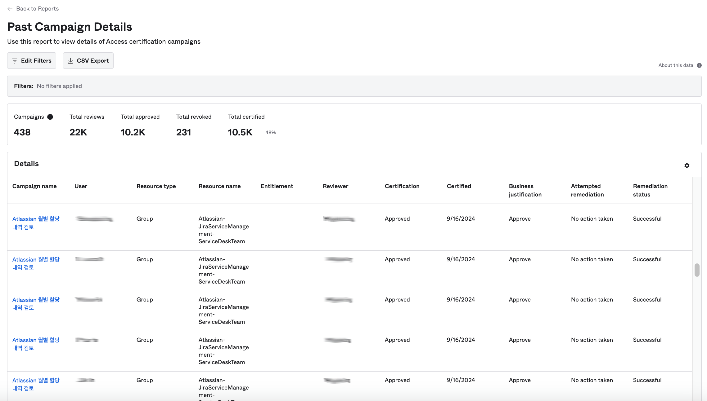

# [Okta] 37. 사용자 앱 접근 권한 신청 승인 관리 현황 검토

## Menu 
Reports > Reports > Entitlements and Access

Reports > Reports > Access Certification Campaigns

## 점검 방법 
### OIG Okta Access Requests 기능 이용 시
- 직무 외 특정 앱에 대한 액세스 권한 또는 권한 상승 신청에 따른 승인 현황을 주기적으로 검토하는 프로세스를 이행하고 있는지 점검합니다. 
- Entitlements and Access > `Past Access Requests` 보고서를 통해 Access Requests 승인 이력을 검토할 수 있습니다. 

### OIG Okta Access Certification Campaigns 활용 시
- 각 사용자 또는 앱별 접근 권한에 대한 주기적 검토를 Otka Access Certifications 캠패인을 통해 이행하고 있는 경우, Access Certification Campaigns > `Past Campaign Details` 보고서를 통해 검토 이력을 조회할 수 있습니다. 

### OIG 미사용 시 
- 권한 신청 승인 프로세스를 어떻게 별도로 관리 운영하고 있고 이에 대한 주기적 관리 검토가 어떻게 수행되고 있는지 별도 확인합니다. 

## Subscription 
OIG

## 관련 통제 항목 (ISMS-P)
- 2.5.6 접근권한 검토
- 2.9.4 로그 및 접속기록 관리
- 2.9.5 로그 및 접속기록 점검
- 2.10.1 보안시스템 운영