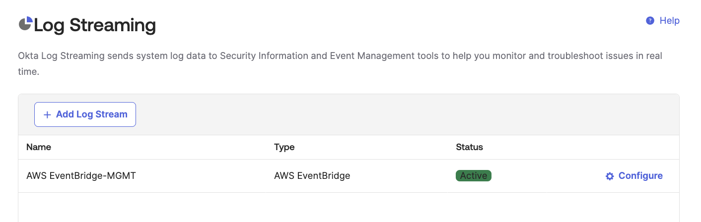

# [Okta] 38. 로그 별도 보관 및 관리 여부

## Menu 
Reports > Log Streaming

## 점검 방법 
Okta는 **최대 90일까지**만 기록을 보관하므로, 별도 로그 보관이 필요합니다. 따라서, Log Streaming이 설정되어있는지 여부 혹은 별도 API연동을 통해 수집이 되어야 합니다. (`Security > API > Tokens`)

- 현재 Okta에서는 Log Streaming을 AWS EventBridge 및 Splunk Cloud만 지원합니다. 
- 위 솔루션을 사용하지 않는 경우, 별도 API를 통해 Okta System Logs를 주기적으로 수집해야 합니다. 

#### [참고] 접속기록 보존기간
- 개인정보처리자: 1년 이상
    - 다만 5만 명 이상의 정보주체에 관하여 개인정보를 처리하거나, 고유식별정보 또는 민감정보를 처리하는 개인정보처리시스템의 경우 2년 이상
- 정보통신서비스 제공자 등: 1년 이상
- ※｢전기통신사업법｣ 제5조에 따른 기간통신사업자: 최소 2년 이상
- 신용정보회사등: 1년 이상

## Subscription 
Default

## 관련 통제 항목 (ISMS-P)
- 2.9.4 로그 및 접속기록 관리
- 2.9.5 로그 및 접속기록 점검