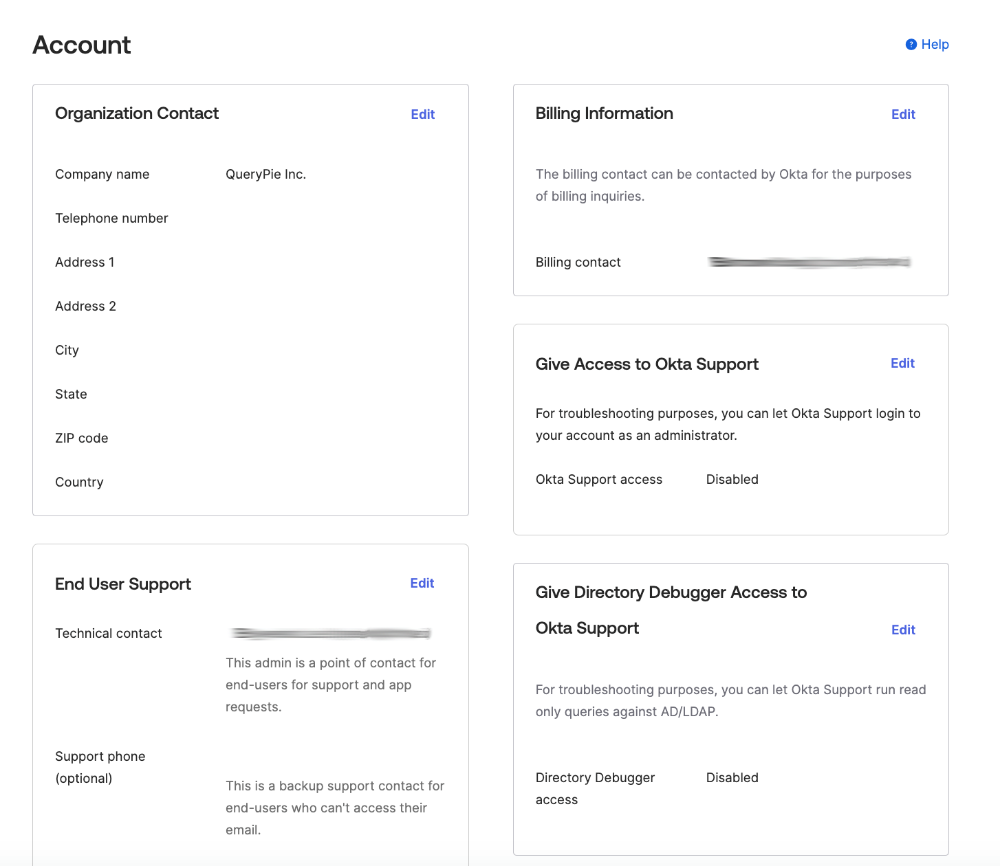

# [Okta] 40. Owner 현황 업데이트 여부

## Menu 
Settings > Account

## 점검 방법 

- **End User Support** 내 `Technical contact`를 적절한 솔루션 관리 Owner로 설정합니다.  
- **Billing Information** 내 `Billing contact`를 적절한 구매관리자로 설정합니다.

## Subscription 
Default

## 관련 통제 항목 (ISMS-P)
- 2.10.1 보안시스템 운영
- 2.10.2 클라우드 보안