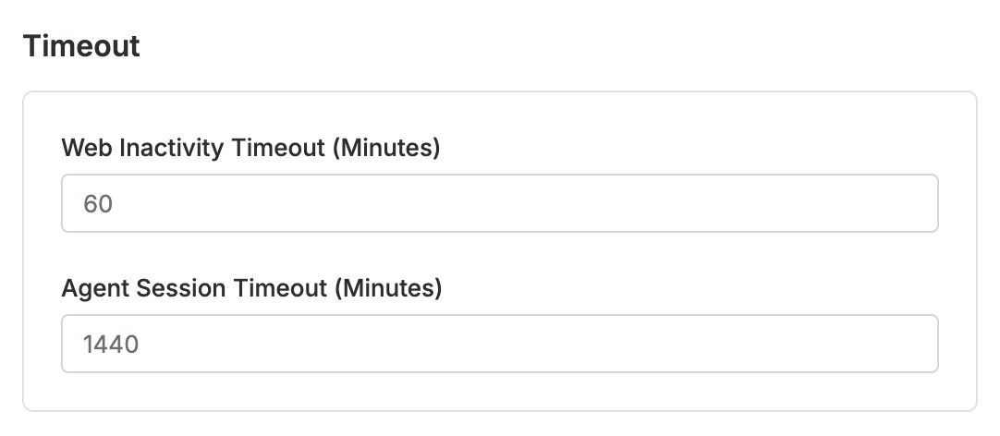

# [QueryPie] 사용자 세션 타임아웃 설정 여부

## Subscription 
Default 

## Menu 
Admin > General > Company Management > Security > Timeout

## 점검 방법 
웹 및 에이전트 접속 세션에 대한 타임아웃 설정이 적정한 수준을 준수하는지 검토합니다.

**검토 대상 항목 및 예시 설정값**

- `Web Inactivity Timeout (Minutes)` : 60분
- `Agent Session Timeout (Minutes)` : 1,440분

## 관련 통제 항목 (ISMS-P)
- 2.5.1 사용자 계정 관리
- 2.10.1 보안시스템 운영
- 2.10.2 클라우드 보안