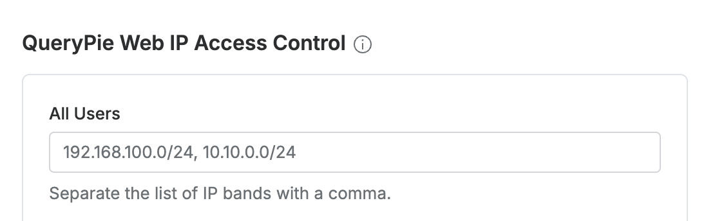

# [QueryPie] 시스템 접근 IP ACL 설정 여부

## Subscription 
Default 

## Menu 
Admin > General > Company Management > Security > QueryPie Web IP Access Control

## 점검 방법 
QueryPie Web Console에 접근 가능한 IP로 0.0.0.0/0 이외의 값이 설정되어있는지 검토합니다. 

**검토 대상 항목 및 예시 설정값**
- `All Users` : 192.168.100.0/24, 10.10.0.0/24

## 관련 통제 항목 (ISMS-P)
- 2.5.6 접근권한 검토
- 2.6.3 응용프로그램 접근
- 2.10.1 보안시스템 운영
- 2.10.2 클라우드 보안