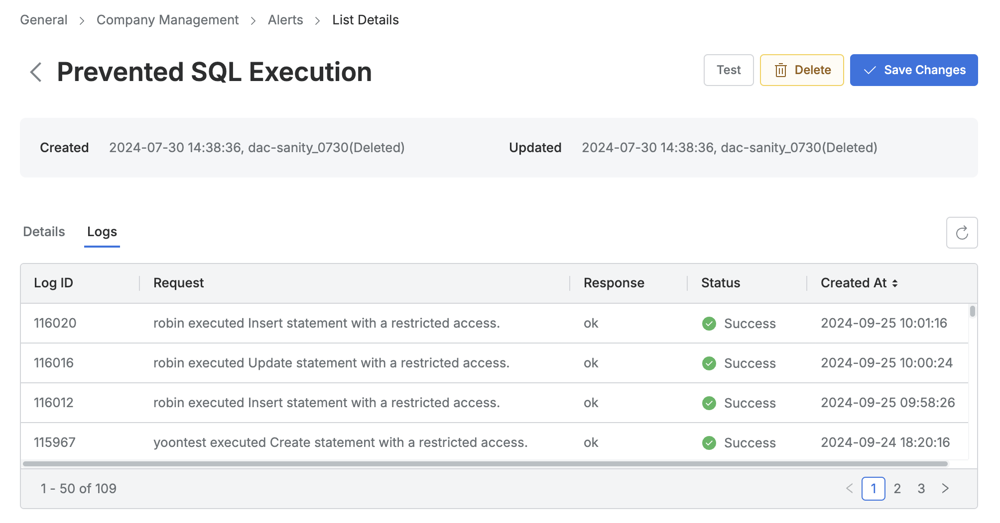

# [QueryPie] 이상 징후 알림 설정 여부

## Subscription 
Default

## Menu 
Admin > General > Company Management > Alerts

## 점검 방법 
인증 실패, 중요 정보 접근, 권한 없는 SQL 수행 실패 등 이상 징후를 탐지하는 경보 정책(Alert)을 설정하고, 임계치를 초과한 이상 행위를 판단하고 조사하는 프로세스 이행 여부를 검토합니다.

**검토 권장 사항**
- Last Event Status 및 Last Event Time 값이 없는 Alert은 발생 이력이 없으므로 실 사용성을 재검토 또는 제거 조치합니다. 

## 관련 통제 항목 (ISMS-P)
- 2.9.5 로그 및 접속기록 점검
- 2.10.1 보안시스템 운영
- 2.10.2 클라우드 보안
- 2.11.1 사고 예방 및 대응체계 구축
- 2.11.3 이상행위 분석 및 모니터링
- 2.11.5 사고 대응 및 복구