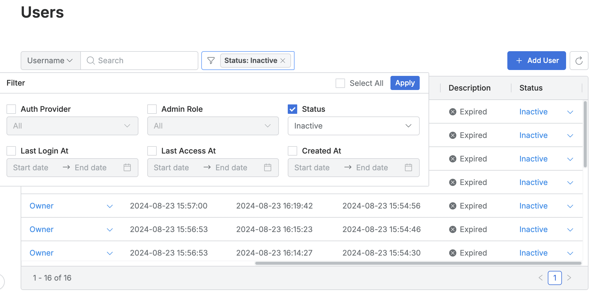

# [QueryPie] 장기 미사용 계정 관리 여부

## Subscription 
Default

## Menu 
Admin > General > User Management > Users 

## 점검 방법 
보안 설정에 의해 Status가 Inactive로 전환된 사용자 계정을 검토, Description 컬럼을 추가로 확인하여 적절한 사유로 조치되었는지 확인합니다.

**계정 상태값별 비활성화 사유**
- `Expired` : 장기간 시스템에 미접속한 계정 
- `Locked` : 다수의 로그인 실패로 인해 잠금 처리된 계정
- `Locked Manually` : 관리자 또는 API에 의해 비활성화 처리된 계정

## 관련 통제 항목 (ISMS-P)
- 2.5.1 사용자 계정 관리
- 2.5.5 특수 계정 및 권한 관리
- 2.9.4 로그 및 접속기록 관리
- 2.9.5 로그 및 접속기록 점검
- 2.10.2 클라우드 보안