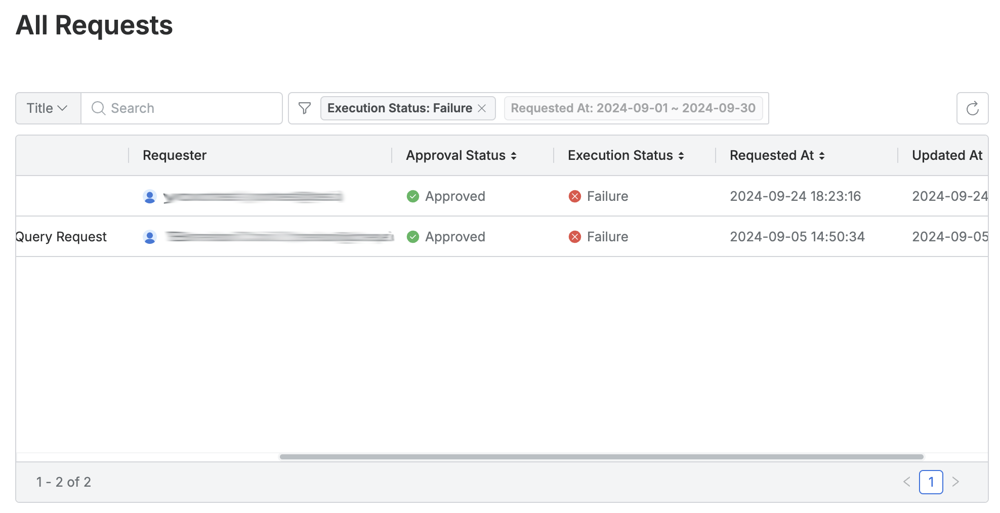
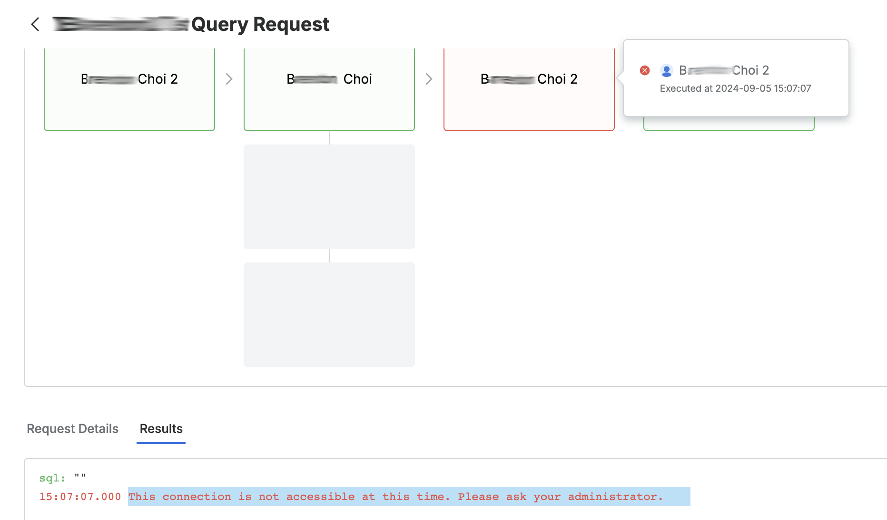

# [QueryPie] 사용자 권한 신청 승인 워크플로 현황 검토

## Subscription 
Default

## Menu 
Admin > General > Workflow Management > All Requests 

## 점검 방법 
DB/시스템 접근 요청, SQL 쿼리 실행 요청 등 사용자가 상신한 결재 건의 승인 내역에 대한 주기적 검토 및 관리 여부를 확인합니다. 

**검토 대상 항목**
- `Execution Status`가 **Failure**인 쿼리 수행 이력이 있다면 검토합니다. 

- `Title` 내 **Urgent** 배지가 달린 사후 승인 결재 건에 대한 주기적 검토 프로세스 이행 여부를 확인합니다. 

## 관련 통제 항목 (ISMS-P)
- 2.5.6 접근권한 검토
- 2.6.2 정보시스템 접근
- 2.6.4 데이터베이스 접근
- 2.9.1 변경관리
- 2.10.1 보안시스템 운영