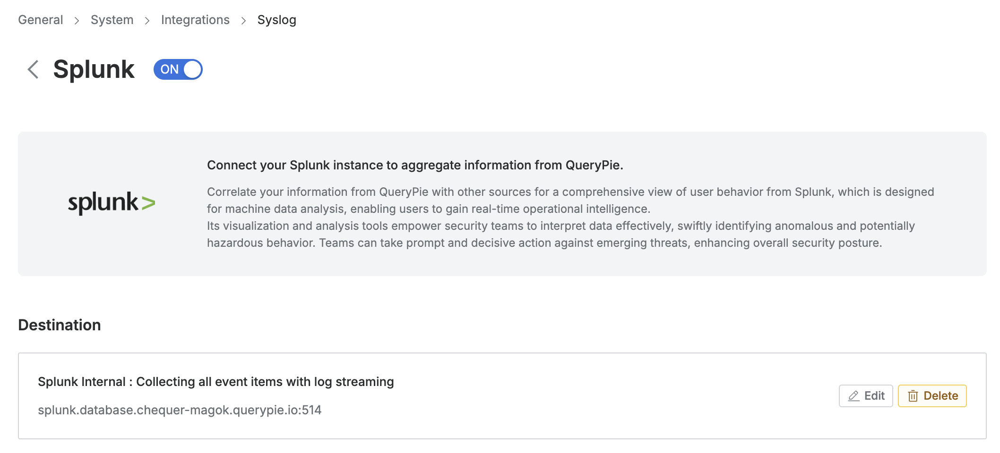

# [QueryPie] 로그 별도 보관 및 관리 여부

## Subscription 
Default

## Menu 
Admin > General > System > Integrations > Syslog / Splunk

## 점검 방법 
로그 백업, 이상 징후 탐지, 원격 모니터링 등의 목적으로 Syslog 또는 Splunk 연동을 통한 로그 별도 수집 여부를 점검합니다. 

**검토 대상 항목**
- Test Connection 기능을 통해 연동 설정의 정상 동작 여부를 검증합니다. 

## 관련 통제 항목 (ISMS-P)
- 2.9.4 로그 및 접속기록 관리
- 2.9.5 로그 및 접속기록 점검