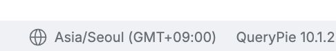
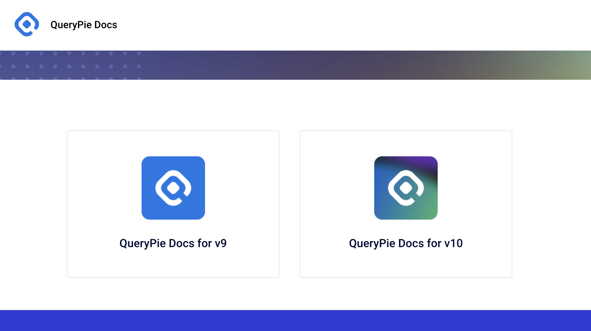

# [QueryPie] 서비스 버전 업데이트 최신화 여부

## Subscription 
Default 

## Menu 
Footer Bar

## 점검 방법 
QueryPie 우측 하단 영역에서 해당 제품의 버전을 확인하여 최신화 관리가 되고 있는지 검토합니다. 

- 해당 제품의 버전 관리를 위한 별도 프로세스 이행 여부를 검토합니다.

    - [쿼리파이 매뉴얼 링크][QUERYPIE_MANUAL]에서 릴리즈 노트 조회가 가능합니다. 

## 관련 통제 항목 (ISMS-P)
- 2.9.1 변경관리
- 2.10.1 보안시스템 운영
- 2.10.8 패치관리

[QUERYPIE_MANUAL]: https://docs.querypie.com/?l=ko "매뉴얼 링크로 이동하세요."