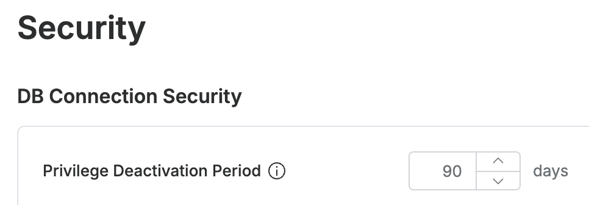

# [QueryPie] 장기 미접속 DB커넥션 접근 권한 비활성화 설정 여부

## Subscription 
DAC (Database Access Controller)

## Menu 
Admin > General > Company Management > Security > DB Connection Security

## 점검 방법 
장기 미접속한 DB 커넥션에 대한 사용자 접근 권한 비활성화 기한이 적정 수준으로 설정되었는지 검토합니다. 

**검토 대상 항목 및 예시 설정값**

- `Privilege Deactivation Period` : 90일

## 관련 통제 항목 (ISMS-P)
- 2.5.6 접근권한 검토
- 2.6.4 데이터베이스 접근
- 2.10.2 클라우드 보안