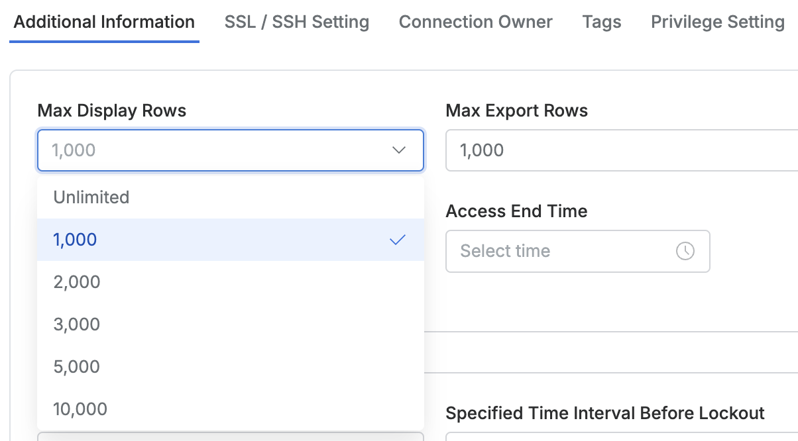

# [QueryPie] 주요 DB 커넥션 별 쿼리 별 허용 최대치 정책 설정 여부

## Subscription 
DAC (Database Access Controller)

## Menu 
Admin > Databases > Connection Management > DB Connections > List Details > Additional Information

## 점검 방법 
주요 정보 자산(원장 또는 PII 등)을 보유하고 있는 DB 커넥션별 조회 및 추출 허용 최대치 설정 여부를 검토합니다. 

**검토 대상 항목** 

- `Max Display Rows` : 쿼리 실행 후 조회 가능한 데이터의 최대 행수를 제한 
- `Max Export Rows` : 한 번에 내보낼 수 있는 데이터의 최대 행수를 제한

## 관련 통제 항목 (ISMS-P)
- 2.6.4 데이터베이스 접근
- 2.10.2 클라우드 보안