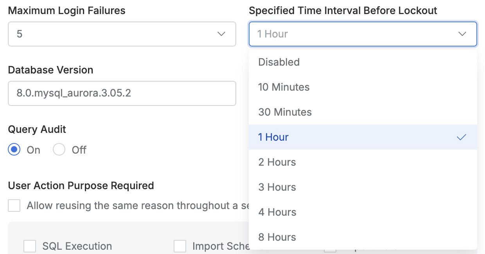

# [QueryPie] 주요 DB 커넥션 별 계정 잠금 정책 설정 여부

## Subscription 
DAC (Database Access Controller)

## Menu 
Admin > Databases > Connection Management > DB Connections > List Details > Additional Information

## 점검 방법 
주요 정보 자산(원장 또는 PII 등)을 보유하고 있는 DB 커넥션에서 반복적인 로그인 실패가 발생할 시 사용자 접근을 제한하는 정책이 설정되어 있는지 여부를 검토합니다.

**검토 대상 항목 및 설정값 예시**

- `Maximum Login Failures` : 5회 또는 DB 내 허용 횟수 이하로 설정
- `Specified Time Interval Before Lockout` : 1시간 

## 관련 통제 항목 (ISMS-P)
- 2.5.3 사용자 인증
- 2.6.4 데이터베이스 접근
- 2.10.2 클라우드 보안