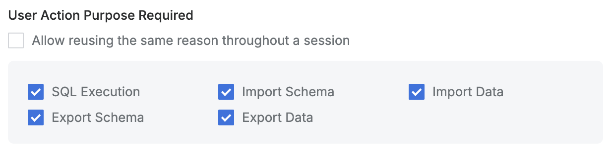

# [QueryPie] 주요 DB 커넥션 별 사유 입력 강제화 설정 여부

## Subscription 
DAC (Database Access Controller)

## Menu 
Admin > Databases > Connection Management > DB Connections > List Details > Additional Information

## 점검 방법 
주요 정보 자산(원장 또는 PII 등)을 보유하고 있는 DB 커넥션별 실행 사유 입력 설정 여부를 검토합니다.

**검토 대상 항목**

- `SQL Execution` : 체크 
    - SQL 쿼리 실행 및 테이블 조회시 사유 입력
- `Import Schema` : 체크 
    - Schema 데이터 가져오기 시 사유 입력
- `Import Data` : 체크 
    - 쿼리 데이터 가져오기 시 사유 입력
- `Export Schema` : 체크 
    - Schema 데이터 내보내기 시 사유 입력
- `Export Data` : 체크 
    - 쿼리 데이터 내보내기 시 사유 입력

## 관련 통제 항목 (ISMS-P)
- 2.6.4 데이터베이스 접근
- 2.10.2 클라우드 보안