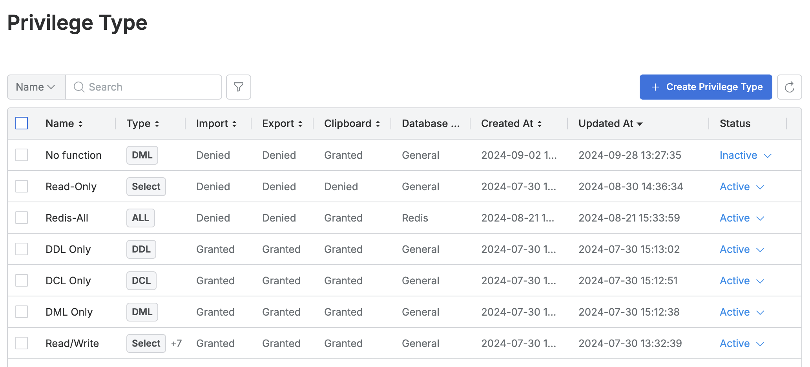
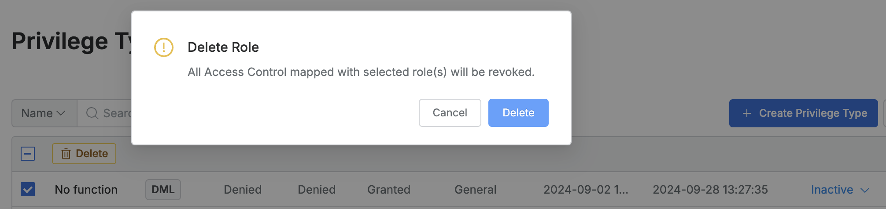

# [QueryPie] DB 접근 권한 현황 검토

## Subscription 
DAC (Database Access Controller)

## Menu 
Admin > Databases > DB Access Control > Privilege Type

## 점검 방법 
- 사용자/그룹에 부여 가능한 DB 접근 권한(**Privilege Type**)이 디폴트로 제공되는 *Read-Only*, *Read/Write* 외 세분화된 권한들이 생성되어 관리되고 있는지 여부를 검토합니다.

- `Status`가 **Inactive**로 설정되어 있는 Privilege Type이 있다면 제거합니다. 

## 관련 통제 항목 (ISMS-P)
- 2.5.6 접근권한 검토
- 2.6.4 데이터베이스 접근
- 2.10.1 보안시스템 운영
- 2.10.2 클라우드 보안