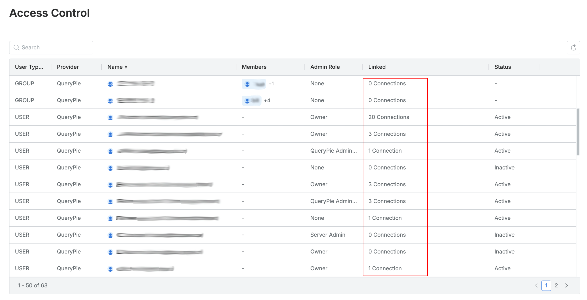
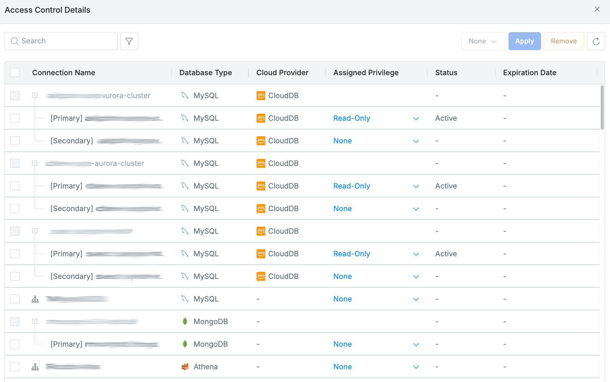
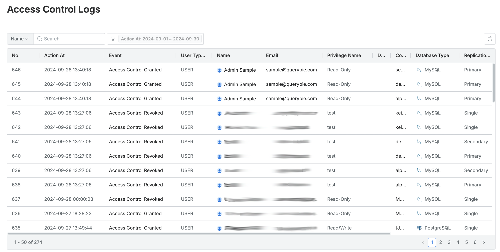

# [QueryPie] 사용자/그룹 별 DB 접근 권한 검토

## Subscription 
DAC (Database Access Controller)

## Menu 
Admin > Databases > DB Access Control > Access Control 

## 점검 방법 
각 사용자/그룹 별 부여된 DB 접근 권한 부여 현황 및 회수 이력에 대한 주기적 검토 여부를 확인합니다. 

- 현황은 `Access Control`에서 조회 가능하며, 

- 이력은 Admin > Audit > Databases > `Access Control Logs`에서 조회 가능합니다.

## 관련 통제 항목 (ISMS-P)
- 2.5.1 사용자 계정 관리
- 2.5.6 접근권한 검토
- 2.6.4 데이터베이스 접근
- 2.10.2 클라우드 보안