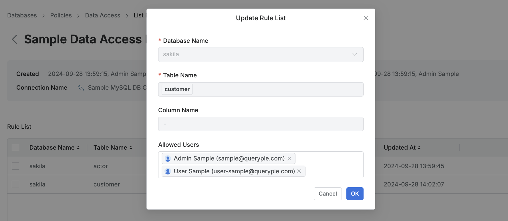
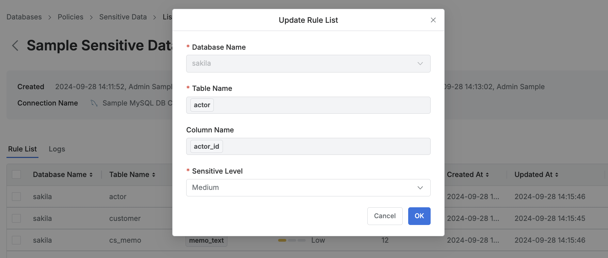
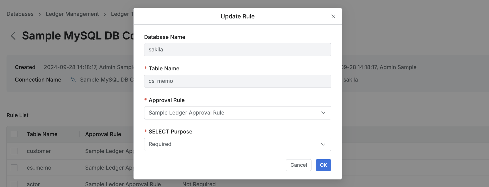

# [QueryPie] 주요 DB 테이블/컬럼 별 접근 제한 정책 설정 여부

## Subscription 
DAC (Database Access Controller)  
(DAC with Ledger Table Management)

## Menu 
Admin > Databases > Policies 

## 점검 방법 
원장 또는 PII 등 주요 정보자산을 보유하고 있는 DB의 커넥션 내 테이블/컬럼 별 접근 정책 설정 및 관리 여부를 검토합니다.
- 데이터 중요도에 따라 접근 제한, 마스킹, 민감도 설정, 로깅 관리, 원장 쿼리 실행 시 사유 입력, 결재, 로깅 강제화 정책을 정의할 수 있습니다.

원장 또는 PII 등 주요 정보자산을 보유하고 있는 DB의 커넥션 정책에 대해 예외 처리된 사용자/그룹(`Allowed Users`)에 대한 검토 및 해당 사용자/그룹에 대한 별도 관리 프로세스를 이행하고 해당 권한의 유효성을 주기적으로 검토하고 있는지 확인합니다. 

**검토 대상 항목**
- `Data Access` : 데이터 테이블/컬럼 접근 차단

- `Data Masking` : 데이터 테이블/컬럼 조회 시 마스킹 처리

- `Sensitive Data` : 민감데이터에 접근한 기록 확인 및 알림에 사용 

- *(Ledger용 라이선스 보유 시)*  
`Ledger Table Policy` : 원장 테이블에 대한 조회 시 사유 입력 강제화 및 작업 시 워크플로 승인 절차 강제화

## 관련 통제 항목 (ISMS-P)
- 2.5.5 특수 계정 및 권한 관리
- 2.5.6 접근권한 검토
- 2.6.4 데이터베이스 접근
- 2.10.1 보안시스템 운영
- 2.10.2 클라우드 보안