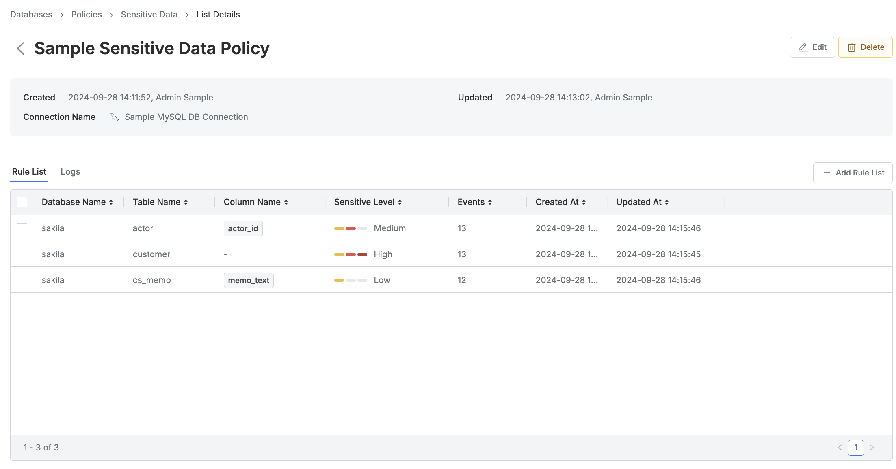
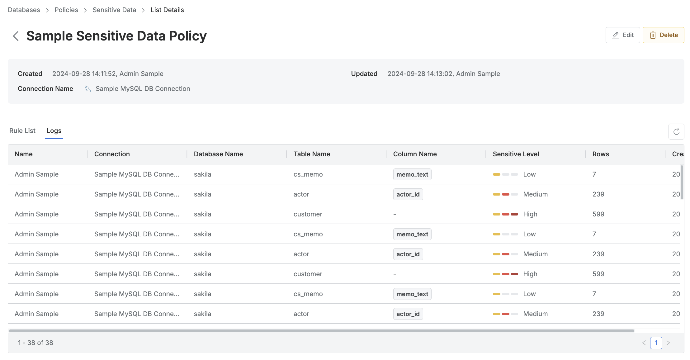

# [QueryPie] 주요 DB 민감 정보 테이블/컬럼 접근 이력 검토

## Subscription 
DAC (Database Access Controller)

## Menu 
Admin > Databases > Policies > Sensitive Data > Logs 

## 점검 방법 
원장 또는 PII 등 주요 정보자산을 보유하고 있는 DB의 커넥션 내 민감 정보 테이블/컬럼 접근 이력을 주기적으로 관리하고 있는지 검토합니다.

## 관련 통제 항목 (ISMS-P)
- 2.6.4 데이터베이스 접근
- 2.10.1 보안시스템 운영
- 2.10.2 클라우드 보안