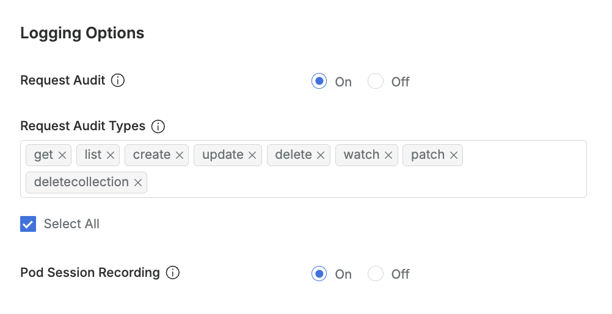

# [QueryPie] 쿠버네티스 클러스터 자산 별 K8S API 감사 설정 활성화 여부

## Subscription 
KAC (Kubernetes Access Controller)

## Menu 
Admin > Kubernetes > Connection Management > Clusters

## 점검 방법 
K8s API에 대한 감사 로깅을 위해 각 쿠버네티스 클러스터 자산별 상세 페이지 내 Logging Options 설정을 활성화하여 운영하고 있는지 점검합니다. 

**검토 대상 항목 및 예시 설정값**

- `Request Audit` : On
- `Request Audit Types` : 최소한 변경 관리의 목적일 경우 **create, update, patch, delete, deletecollection** 선택

## 관련 통제 항목 (ISMS-P)
- 2.9.1 변경관리
- 2.9.4 로그 및 접속기록 관리
- 2.10.1 보안시스템 운영