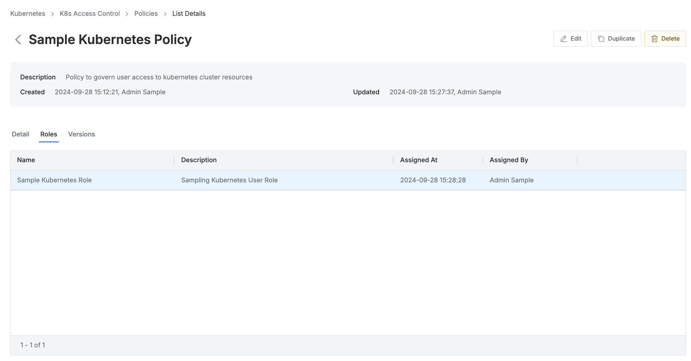
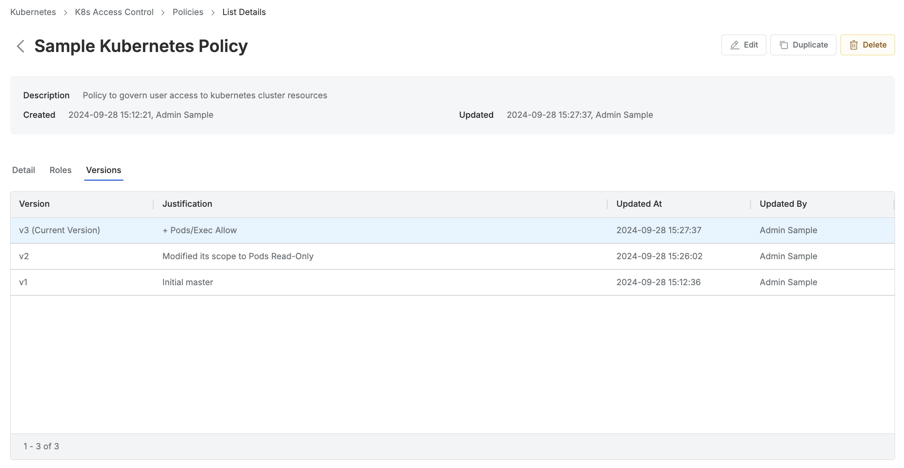
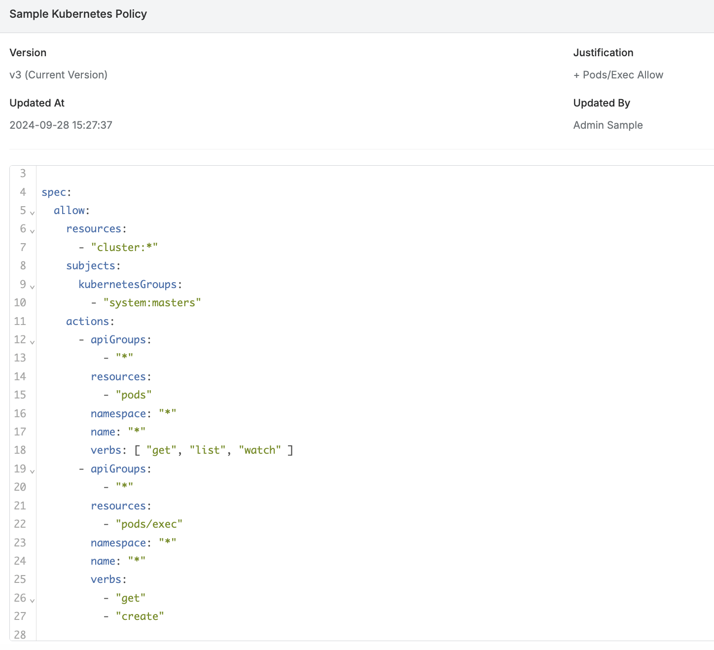

# [QueryPie] 쿠버네티스 접근 정책 관리 현황 검토

## Subscription 
KAC (Kubernetes Access Controller)

## Menu 
Admin > Kubernetes > K8s Access Control > Policies

## 점검 방법 
쿠버네티스 접근 정책에 대한 변경관리, 사용 현황, 과도한 권한 부여 등 전반 정책에 대한 주기적 검토 프로세스가 이행 및 조치되고 있는지 검토합니다.

**검토 대상 항목**

- 각 정책 별 상세페이지 내 **Roles** 탭 조회 시 적용된 Role이 확인되지 않으면 미사용 정책이므로 제거합니다. 

- 각 정책 별 상세페이지 내 **Versions** 탭 조회를 통해 해당 정책의 변경이력을 주기적으로 검토하여 관리하고 있는지 점검합니다.

## 관련 통제 항목 (ISMS-P)
- 2.5.6 접근권한 검토
- 2.6.2 정보시스템 접근
- 2.9.1 변경관리
- 2.10.1 보안시스템 운영
- 2.10.2 클라우드 보안