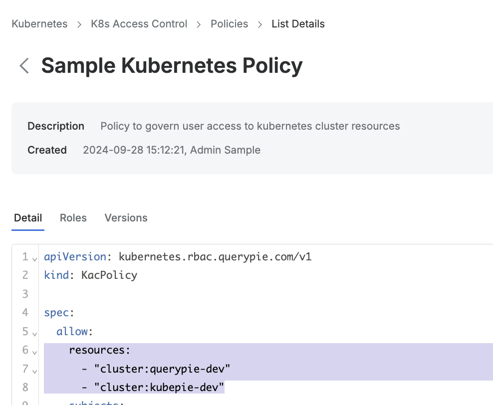
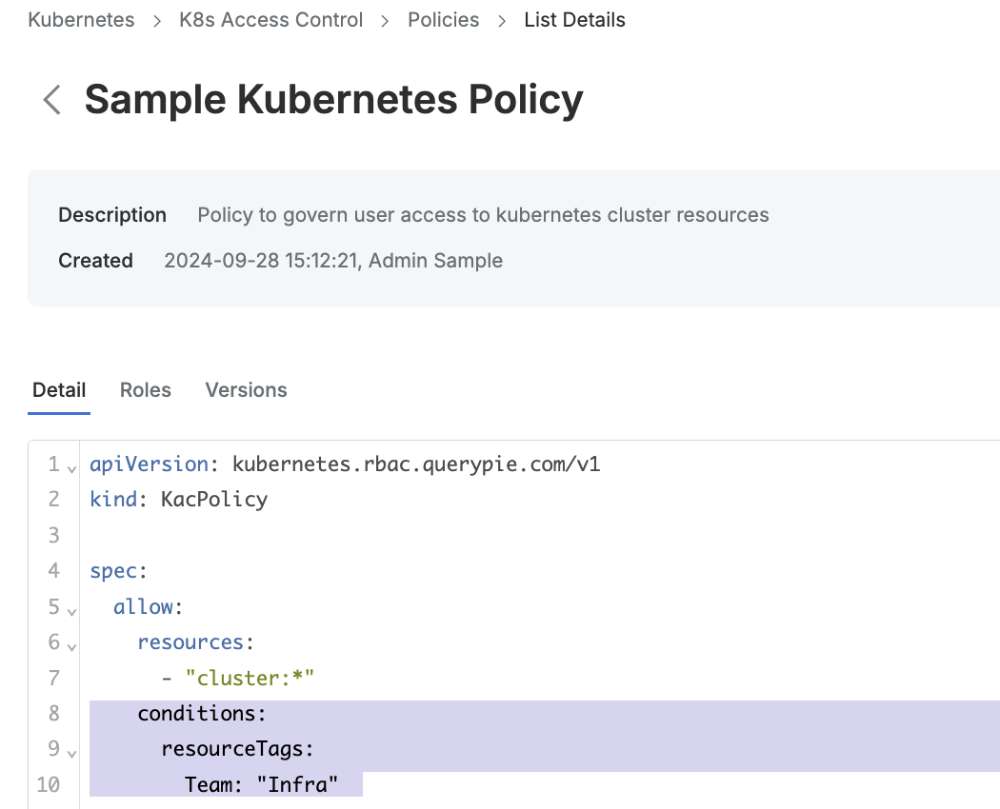

# [QueryPie] 쿠버네티스 접근 정책 별 대상 클러스터 리소스 최소화 설정 여부

## Subscription 
KAC (Kubernetes Access Controller)

## Menu 
Admin > Kubernetes > K8s Access Control > Policies > Detail

## 점검 방법 
쿠버네티스 접근 정책 내 접근 가능한 클러스터 리소스가 과도하게 잡혀 있진 않은지 점검합니다.

**검토 대상 항목**
- **spec.allow.resources** 항목에 와일드 카드를 허용하나 전체 클러스터를 대상으로 하는 단일 `*` 보다 세부적으로 명시합니다.

- 또는 **spec.allow.conditions.resourceTags** 항목에 리소스 태그를 지정하여 대상 클러스터를 태그 기반으로 제한하여 관리합니다.

## 관련 통제 항목 (ISMS-P)
- 2.5.6 접근권한 검토
- 2.6.2 정보시스템 접근
- 2.10.1 보안시스템 운영
- 2.10.2 클라우드 보안