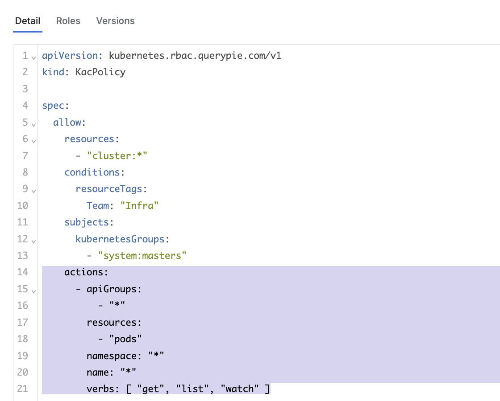

# [QueryPie] 쿠버네티스 접근 정책 별 세분화된 API 권한 제한 설정 여부

## Subscription 
KAC (Kubernetes Access Controller)

## Menu 
Admin > Kubernetes > K8s Access Control > Policies > Detail

## 점검 방법 
쿠버네티스 접근 정책 내 지정한 리소스를 대상으로 세분화된 API 권한 제한 설정 여부 검토합니다. 
- **actions** 설정 모든 항목 전체를 `*` 처리하는 것보다 세부적으로 명시하여 관리합니다.
- 다중 액션을 단일 정책에 부여를 허용하나 연관성이 부족한 권한에 대해서는 분리된 정책으로 관리합니다. 

**검토 대상 항목**


- **spec.allow.actions.apiGroups** : 단일 리소스 대상으로 설정 시 해당 리소스에 맞는 apiGroup으로 설정합니다.
- **spec.allow.actions.resources** : API 호출 대상 쿠버네티스 리소스 특정합니다. 
- **spec.allow.actions.namespace** : 대상 리소스의 네임스페이스를 특정합니다.
- **spec.allow.actions.name** : 대상 리소스명을 특정합니다.
- **spec.allow.actions.verbs** : 필요한 최소한의 API action verb를 설정합니다.

### Actions 설정 샘플
```yaml
    actions:
    # 전체 Pods의 Read-Only 권한만 특정 
      - apiGroups:
          - "*"
        resources:
          - "pods"
        namespace: "*"
        name: "*"
        verbs: 
          - "get"
          - "list"
          - "watch"
```

## 관련 통제 항목 (ISMS-P)
- 2.5.6 접근권한 검토
- 2.6.2 정보시스템 접근
- 2.10.1 보안시스템 운영
- 2.10.2 클라우드 보안