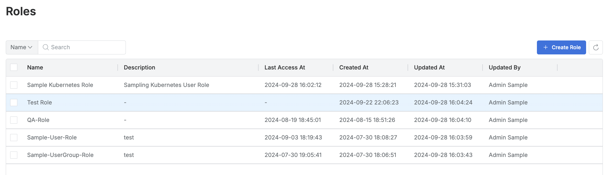
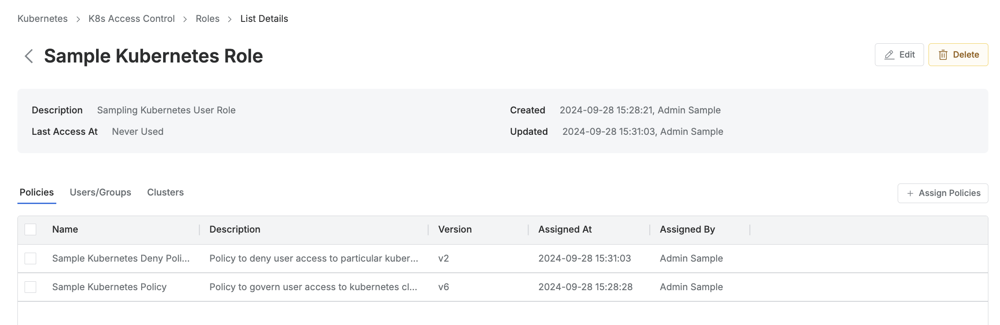
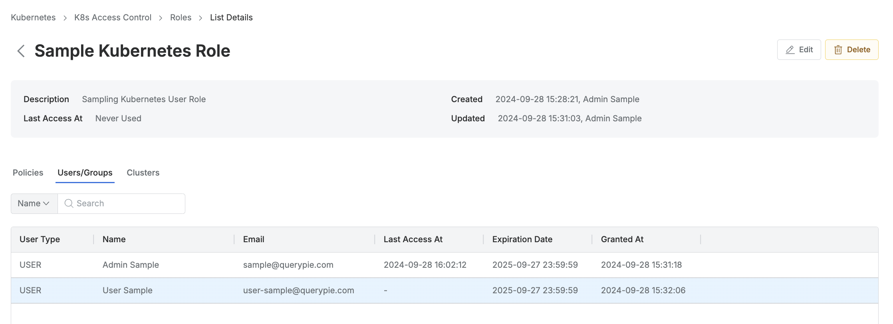

# [QueryPie] 쿠버네티스 접근 역할 권한 현황 관리 여부

## Subscription 
KAC (Kubernetes Access Controller)

## Menu 
Admin > Kubernetes > K8s Access Control > Roles

## 점검 방법 
쿠버네티스 접근 역할 권한(Roles)에 대한 사용 현황 등을 주기적으로 검토하여 관리하고 있는지 점검합니다. 
- 직무별 최소한의 권한을 부여를 위해 세부적으로 권한을 분할 생성하여 관리하고 있는지 검토합니다.

**검토 대상 항목**
- 각 역할별 `Last Access At` 컬럼을 통해 마지막 사용 일시가 장기간에 해당하면 해당 Role에 대한 제거 조치를 진행합니다. (30일 이상 미사용 Role 제거) 

- 각 역할별 상세 페이지 내 **Policies** 탭에서 조회되는 접근 정책이 없다면 해당 역할의 사용성을 재검토하여 제거 조치

- 각 역할별 상세 페이지 내 **Users/Groups** 탭에서 `Last Access At`(마지막 사용일시)이 일정 기간을 넘어가는 사용자/그룹이 있다면 역할에서 제외 조치 (최대 90일)

## 관련 통제 항목 (ISMS-P)
- 2.5.6 접근권한 검토
- 2.6.2 정보시스템 접근
- 2.10.1 보안시스템 운영
- 2.10.2 클라우드 보안