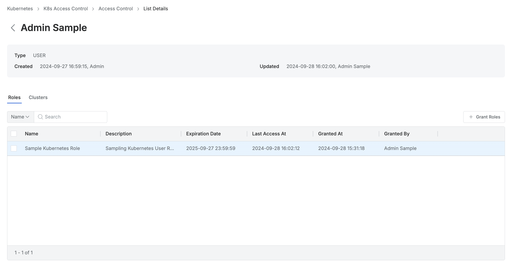
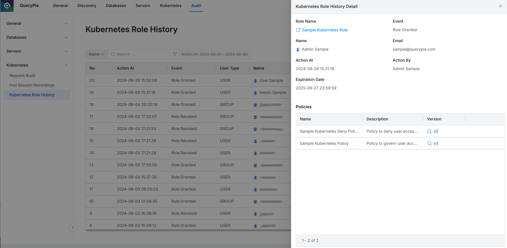

# [QueryPie] 사용자/그룹 별 쿠버네티스 접근 역할 권한 부여 현황 검토

## Subscription 
KAC (Kubernetes Access Controller)

## Menu 
Admin > Kubernetes > K8s Access Control > Access Control 

Admin > Audit > Kubernetes > Kubernetes Role History

## 점검 방법 
쿠버네티스 접근 역할 권한(Roles)에 대한 사용 현황 등을 사용자/그룹 관점에서 주기적으로 검토하여 관리하고 있는지 점검합니다. 
- 직무별 최소한의 권한으로 구성한 Role을 사용자/그룹에 부여한 상태인지 검토합니다. 

**검토 대상 항목**
- 목록 내 Roles 컬럼을 통해 해당 역할(Role)이 부여된 대상 조회가 가능합니다.

    - 각 사용자/그룹별 상세페이지 내 **Roles** 탭에서 `Last Access At`(마지막 사용일시)이 일정 기간을 넘어간다면 역할에서 제외합니다. (90일 이상 미사용 Role 회수)
    

- 쿠버네티스 역할 권한 부여/회수 이력은 Admin > Audit > Kubernetes > `Kubernetes Role History`에서 조회 가능합니다. 

## 관련 통제 항목 (ISMS-P)
- 2.5.6 접근권한 검토
- 2.6.2 정보시스템 접근
- 2.10.1 보안시스템 운영
- 2.10.2 클라우드 보안