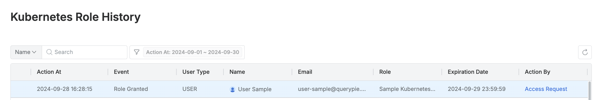

# [QueryPie] 쿠버네티스 접근 역할 권한 승인 현황 검토

## Subscription 
KAC (Kubernetes Access Controller)

## Menu 
Admin > General > Workflow Management > All Requests

Admin > Kubernetes > K8s Access Control > Access Control  

Admin > Audit > Kubernetes > Kubernetes Role History

## 점검 방법 
직무 외 쿠버네티스 접근 역할 권한(Roles)을 사용자가 결재를 통해 받은 경우 승인 이력이 남아야 하므로 증적에 대한 주기적 검토를 이행하고 있는지 확인합니다. (`Access Role Request`)

**검토 대상 항목**
- 각 사용자/그룹 별 상세페이지 내 **Roles** 탭에서 `Last Access At`(마지막 사용일시)이 일정 기간을 넘어간다면 역할에서 제외합니다. (90일 이상 미사용 Role 회수)

- 쿠버네티스 역할 권한 부여/회수 이력은 Admin > Audit > Kubernetes > Kubernetes Role History에서 조회 가능합니다. 

## 관련 통제 항목 (ISMS-P)
- 2.5.6 접근권한 검토
- 2.6.2 정보시스템 접근
- 2.10.1 보안시스템 운영
- 2.10.2 클라우드 보안