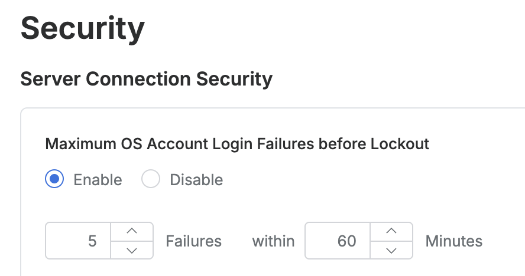

# [QueryPie] 서버 로그인 실패 시 서버 계정 잠금 정책 설정 여부

## Subscription 
SAC (System Access Controller)

## Menu 
Admin > General > Company Management > Security > Server Connection Security

## 점검 방법 
서버 커넥션 로그인 실패가 반복될 경우 계정이 잠금 처리되도록 설정하였는지 검토합니다. 

**검토 대상 항목 및 예시 설정값**

- `Maximum OS Account Login Failures before Lockout` : Enable
- `{n} Failures` : 5회
- `within {n} Minutes` : 60분

## 관련 통제 항목 (ISMS-P)
- 2.6.2 정보시스템 접근
- 2.10.1 보안시스템 운영
- 2.10.2 클라우드 보안