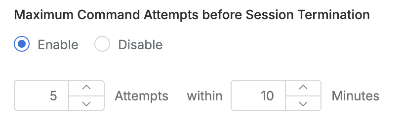

# [QueryPie] 제한된 명령어 사용 시도 시 세션 강제 종료 설정 여부

## Subscription 
SAC (System Access Controller)

## Menu 
Admin > General > Company Management > Security > Server Connection Security

## 점검 방법 
접근한 서버 내 제한된 명령어 호출 시도가 반복될 경우 세션이 강제 종료되도록 설정하였는지 검토합니다. 

**검토 대상 항목 및 예시 설정값**

- `Maximum Command Attempts before Session Termination` : Enable
- `{n} Attempts` : 5회
- `within {n} Minutes` : 10분

## 관련 통제 항목 (ISMS-P)
- 2.6.2 정보시스템 접근
- 2.10.1 보안시스템 운영
- 2.10.2 클라우드 보안