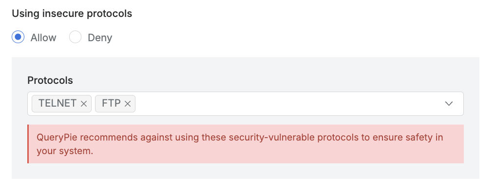
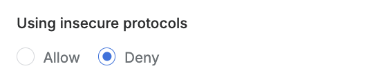

# [QueryPie] 안전하지 않은 서버 프로토콜 사용 비활성화 여부

## Subscription 
SAC (System Access Controller)

## Menu 
Admin > General > Company Management > Security > Server Connection Security

## 점검 방법 
시스템 자산 연결 시 `TELNET`, `FTP` 등 안전하지 않은 프로토콜의 사용 여부를 검토합니다.  
_(사용 시 어떤 서버 자산을 대상으로 사용되고 있는지, 안전한 접근 수단 적용 계획이 있는지 추가적으로 검토가 필요합니다.)_

**검토 대상 항목 및 예시 설정값**

- `Using insecure protocols` : Deny

## 관련 통제 항목 (ISMS-P)
- 2.6.2 정보시스템 접근
- 2.10.1 보안시스템 운영
- 2.10.2 클라우드 보안