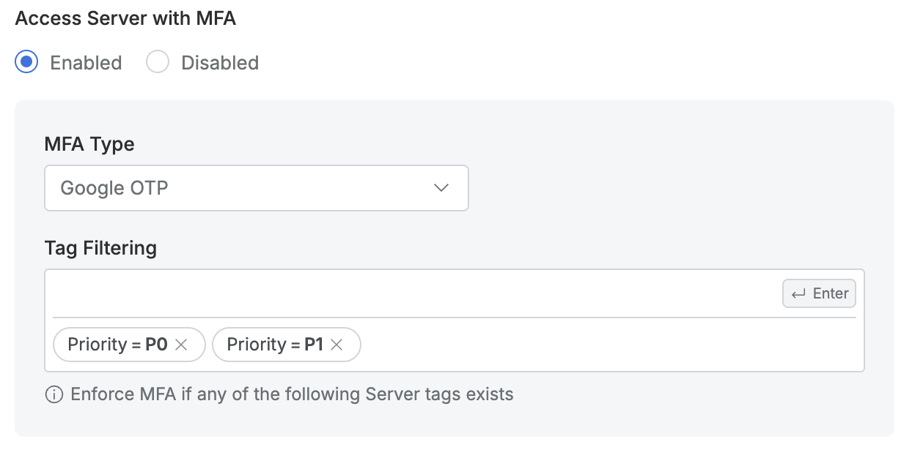

# [QueryPie] 주요 서버 자산에 대한 2차 인증 설정 적용 여부

## Subscription 
SAC (System Access Controller)

## Menu 
Admin > General > Company Management > Security > Server Connection Security

## 점검 방법 
주요 서버 자산에 대한 2차 인증 설정 활성화 여부 및 적용 대상을 검토합니다. 

**검토 대상 항목 및 예시 설정값**

- `Access Server with MFA` : Enabled
- `Tag Filtering` : _지정한 태그에 해당하는 서버 자산 주기적 검토 여부 추가 확인 필요_

## 관련 통제 항목 (ISMS-P)
- 2.5.3 사용자 인증
- 2.5.6 접근권한 검토
- 2.6.2 정보시스템 접근
- 2.10.1 보안시스템 운영
- 2.10.2 클라우드 보안