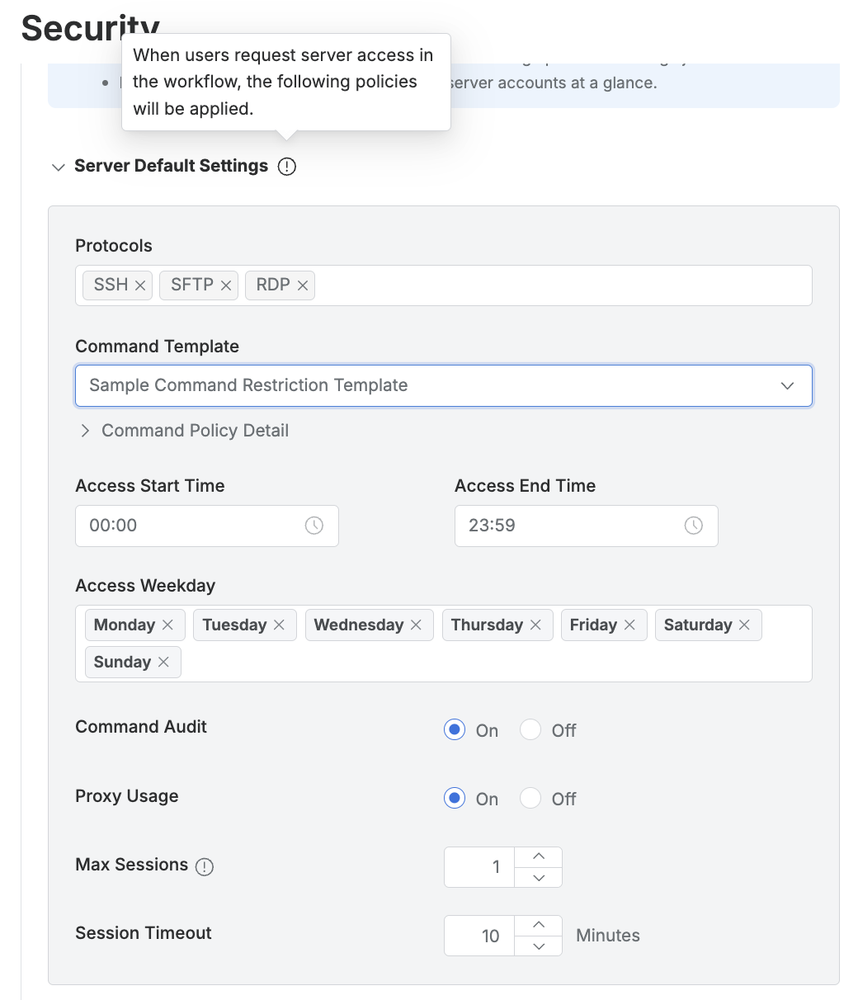

# [QueryPie] 사용자 요청 승인 서버에 대한 동시 접속 세션 수 제한 설정 여부

## Subscription 
SAC (System Access Controller)

## Menu 
Admin > General > Company Management > Security > Server Connection Security > Server Default Settings

## 점검 방법 
결재를 통해 접근 권한을 받은 서버에 접속할 수 있는 개인 별 최대 세션 수 설정의 적절성을 검토합니다.

**검토 대상 항목 및 예시 설정값**

- `Max Sessions` : 1

## 관련 통제 항목 (ISMS-P)
- 2.5.3 사용자 인증
- 2.6.2 정보시스템 접근
- 2.10.2 클라우드 보안