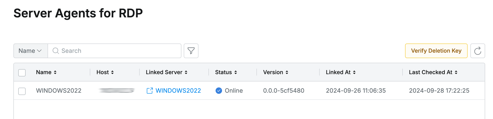

# [QueryPie] 서버 에이전트 관리 현황 검토

## Subscription 
SAC (System Access Controller)

## Menu 
Admin > Servers > Connection Management > Server Agents for RDP

## 점검 방법 
윈도우 RDP용 서버 에이전트에 대한 현황 및 패치 관리가 주기적으로 이루어지고 있는지 검토합니다. 

**검토 대상 항목**

- `Status` : **Offline**으로 표기된 에이전트에 대한 이슈 식별 및 조치(업데이트 또는 제거)를 이행합니다. 
- `Linked Server` : 서버 자산과의 링크 연결이 되지 않은 방치 에이전트 유무 검토 및 업데이트 또는 제거를 이행합니다.
- `Version` : 에이전트에 대한 버전 최신화 관리 프로세스 이행 여부를 점검합니다. 

## 관련 통제 항목 (ISMS-P)
- 2.6.2 정보시스템 접근
- 2.10.1 보안시스템 운영
- 2.10.2 클라우드 보안
- 2.10.8 패치관리