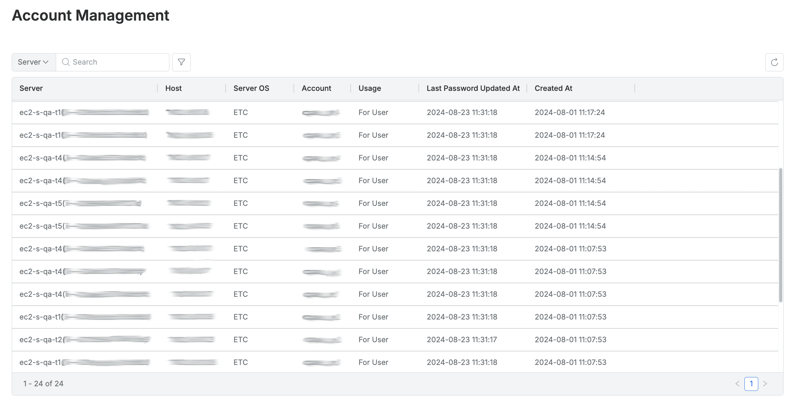
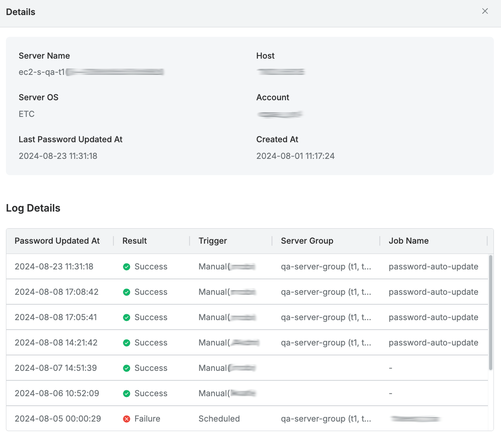

# [QueryPie] 서버 패스워드 변경이력 검토

## Subscription 
SAC (System Access Controller)

## Menu 
Admin > Servers > Server Account Management > Account Management 

## 점검 방법 
서버 패스워드에 대한 변경이력에 대한 주기적 검토를 이행하고 있는지 점검합니다. (쿼리파이의 **Password Provisioning** 기능을 활성화한 경우 해당합니다.)

- 각 서버별 Account 상세 페이지의 **Log Details**에서 패스워드 변경 이력의 결과가 `Failure`인 계정에 대한 이슈 식별 및 추가 조치 여부를 검토합니다. 

## 관련 통제 항목 (ISMS-P)
- 2.5.4 비밀번호 관리
- 2.9.1 변경관리
- 2.10.1 보안시스템 운영
- 2.10.2 클라우드 보안