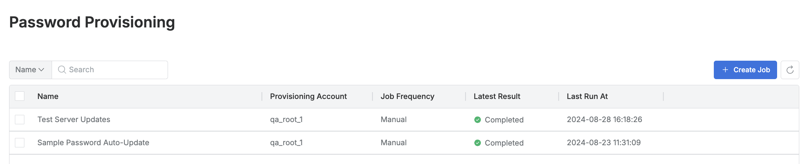
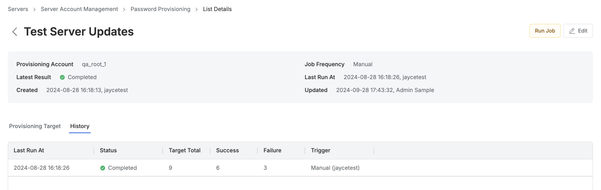
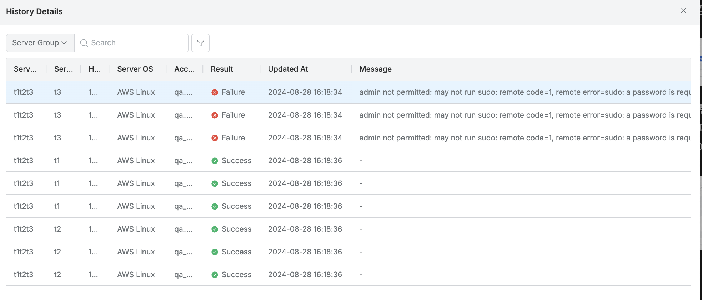

# [QueryPie] 서버 패스워드 변경 자동화 작업 관리 현황 검토

## Subscription 
SAC (System Access Controller)

## Menu 
Admin > Servers > Server Account Management > Password Provisioning 

## 점검 방법 
패스워드 변경 자동화 작업(Job)에 대한 주기적 현황 검토를 이행하고 있는지 점검합니다. (쿼리파이의 **Password Provisioning** 기능을 활성화한 경우 해당합니다.)

- `Latest Result`가 **Failed**인 작업에 대한 이슈 식별 및 조치 프로세스 수립 및 이행 여부를 검토합니다. 

- 작업 상세 페이지 > History 탭 > 가장 최근 수행된 작업 이력 조회 시, 패스워드 자동 변경에 실패한 계정에 대한 사유 확인 및 별도 관리 조치를 이행하고 있는지 점검합니다. 

## 관련 통제 항목 (ISMS-P)
- 2.5.4 비밀번호 관리
- 2.9.1 변경관리
- 2.10.1 보안시스템 운영
- 2.10.2 클라우드 보안