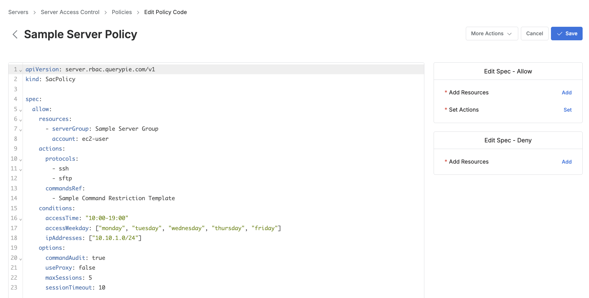
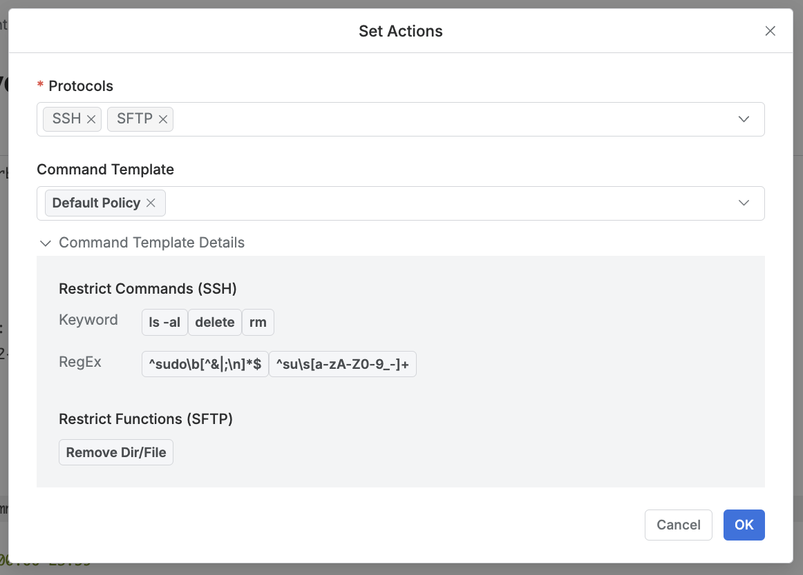

# [QueryPie] 서버 접근 정책 별 제한 명령어 템플릿 설정 검토

## Subscription 
SAC (System Access Controller)

## Menu 
Admin > Servers > Server Access Control > Policies > Detail

## 점검 방법 
서버 접근 정책 내 지정한 리소스를 대상으로 충분한 명령어 제한이 적용되어 관리되고 있는지 검토합니다. 

**검토 대상 항목**

- **spec.allow.actions.commandsRef** 항목에 `Default Policy` 외 별도 템플릿 적용
    - 단, Default Policy에 대한 명령어 제한이 디폴트 그대로가 아닌 충분히 반영되어 있다면 문제 없음
    

## 관련 통제 항목 (ISMS-P)
- 2.5.6 접근권한 검토
- 2.6.2 정보시스템 접근
- 2.10.1 보안시스템 운영
- 2.10.2 클라우드 보안