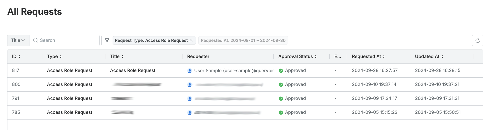
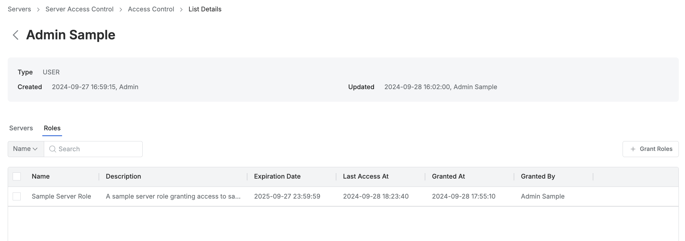
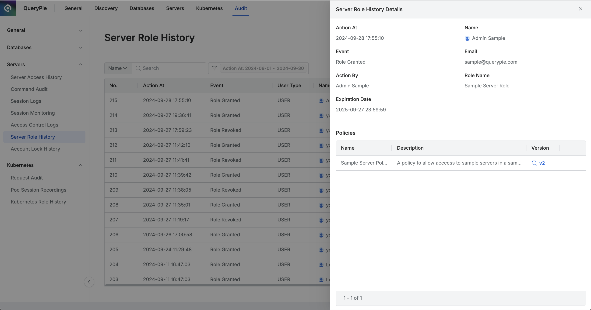

# [QueryPie] 사용자/그룹 별 서버 접근 역할 권한 부여 현황 검토

## Subscription 
SAC (System Access Controller)

## Menu 
Admin > General > Workflow Management > All Requests

Admin > Servers > Server Access Control > Access Control 

Admin > Audit > Servers > Server Role History

## 점검 방법 
서버 접근 역할(Roles)에 대한 사용 현황 등을 사용자/그룹 관점에서 주기적으로 검토하여 관리하고 있는지 점검합니다.
- 직무별 최소한의 권한을 설정한 역할(Role)을 사용자/그룹에 부여한 것인지 검토합니다.

**검토 대상 항목**

- 직무 외 권한에 대한 역할의 경우, 결재 절차를 통해 부여한 이력이 남아야 하므로, 증적에 대한 주기적 검토 확인합니다.  
(`Access Role Request`)

- 목록 내 Roles 컬럼을 통해 해당 역할(Role)이 부여된 대상 조회가 가능합니다.

    - 각 사용자/그룹별 상세페이지 내 **Roles** 탭에서 `Last Access At`(마지막 사용일시)이 일정 기간을 넘어간다면 역할에서 제외합니다. (90일 이상 미사용 Role 회수)
    

- 서버 역할 권한 부여/회수 이력은 Admin > Audit > Servers > `Server Role History`에서 조회 가능합니다. 

## 관련 통제 항목 (ISMS-P)
- 2.5.6 접근권한 검토
- 2.6.2 정보시스템 접근
- 2.10.1 보안시스템 운영
- 2.10.2 클라우드 보안