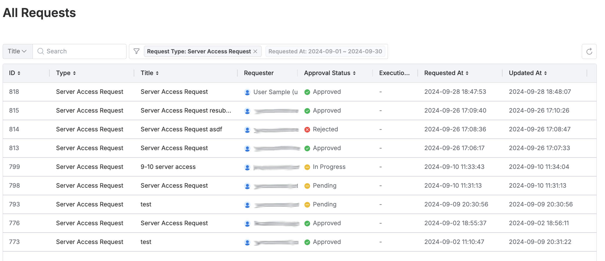
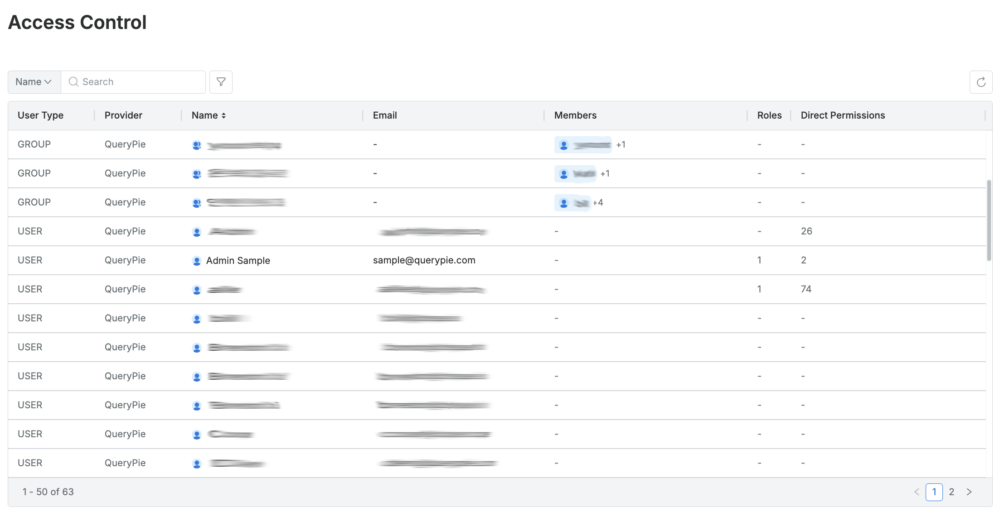
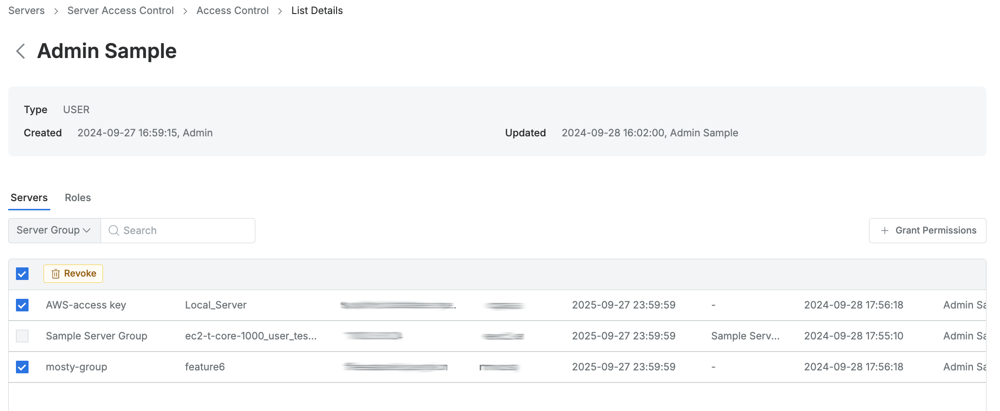
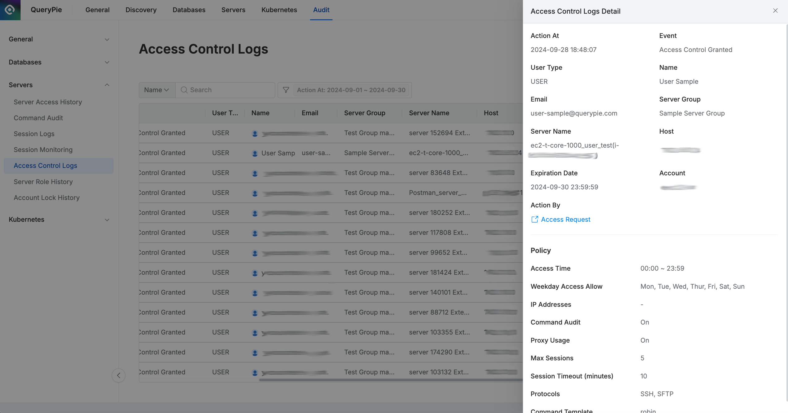
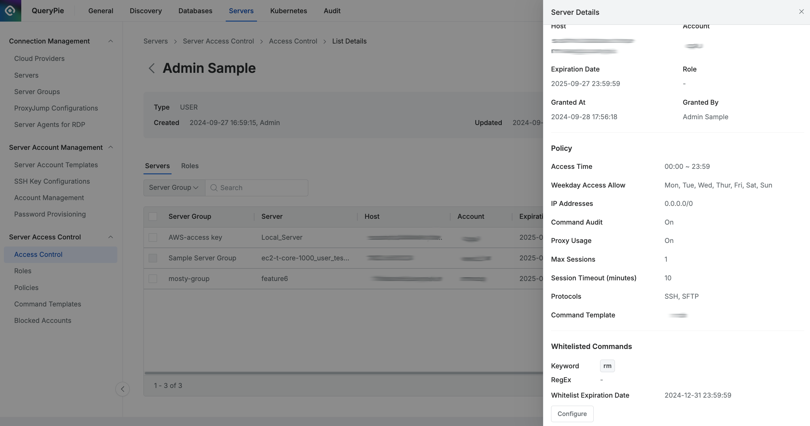

# [QueryPie] 사용자/그룹 별 직접 부여된 서버 접근 권한 현황 검토

## Subscription 
SAC (System Access Controller)

## Menu 
Admin > General > Workflow Management > All Requests

Admin > Servers > Server Access Control > Access Control 

Admin > Audit > Servers > Access Control Logs

## 점검 방법 
사용자/그룹을 대상으로 직접적으로 부여된 서버 접근 권한(**Direct Permissions**)에 대한 현황 등을 주기적으로 검토하여 관리하고 있는지 점검합니다.

**검토 대상 항목**

- 다이렉트 서버 접근 권한의 경우, 사용자가 결재 절차를 통해 부여받은 이력이 남아야 하므로, 증적에 대한 주기적 검토 여부를 확인합니다. (`Server Access Request`)

- 목록 내 Direct Permissions 컬럼을 통해 다이렉트 권한이 부여된 대상 조회가 가능합니다.

    - 각 사용자/그룹별 상세페이지 내 **Servers** 탭에서 **좌측 체크박스가 살아있는 서버**가 직접 부여된 서버 접근 권한(**Direct Permissions**)에 해당합니다. 
    

- 서버 역할 권한 부여/회수 이력은 Admin > Audit > Servers > `Access Control Logs`에서 조회 가능합니다. 

- Access Control > 사용자/그룹 상세 페이지 > Servers 탭 > 상세 페이지에서 명령어 예외 처리(**Whitelist Granted**) 권한을 받은 것으로 확인될 경우 해당 권한 부여에 따른 별도 사유 관리가 이행되고 있는지 검토합니다. (Direct Permission에 한하여 반영 가능합니다.)

## 관련 통제 항목 (ISMS-P)
- 2.5.6 접근권한 검토
- 2.6.2 정보시스템 접근
- 2.10.1 보안시스템 운영
- 2.10.2 클라우드 보안
