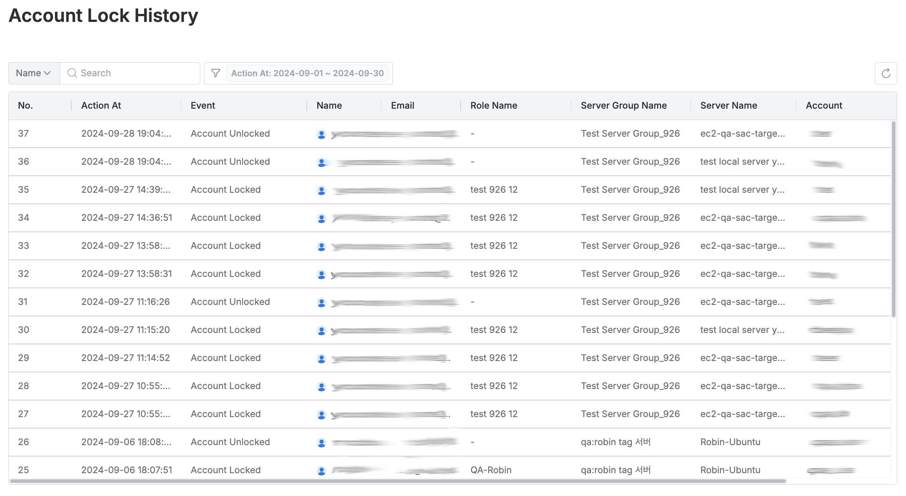

# [QueryPie] 사용자 별 Account 잠금 현황 관리 여부

## Subscription 
SAC (System Access Controller)

## Menu 
Admin > Servers > Server Access Control > Blocked Accounts

Admin > Audit > Servers > Account Lock History

## 점검 방법 
각 사용자별, 서버 계정별 서버 접근 시 반복적인 인증 실패로 인한 서버 계정 접속 잠금 현황 주기적 검토 및 관리 여부를 확인합니다. 

**검토 대상 항목**

- `Status`가 **Locked**인 계정이 있다면 잠금 사유 확인을 통해 **Unlock** 조치를 정기적으로 이행하는지 점검합니다.
- `Blocked At`의 기간이 일정 수준을 넘어선 건에 대해서는 해당 서버 계정에 대한 권한을 회수 조치해야 합니다.

- 잠금 이력은 Admin > Audit > Servers > `Account Lock History`에서 조회 가능합니다.

## 관련 통제 항목 (ISMS-P)
- 2.5.1 사용자 계정 관리
- 2.5.6 접근권한 검토
- 2.6.2 정보시스템 접근
- 2.10.2 클라우드 보안