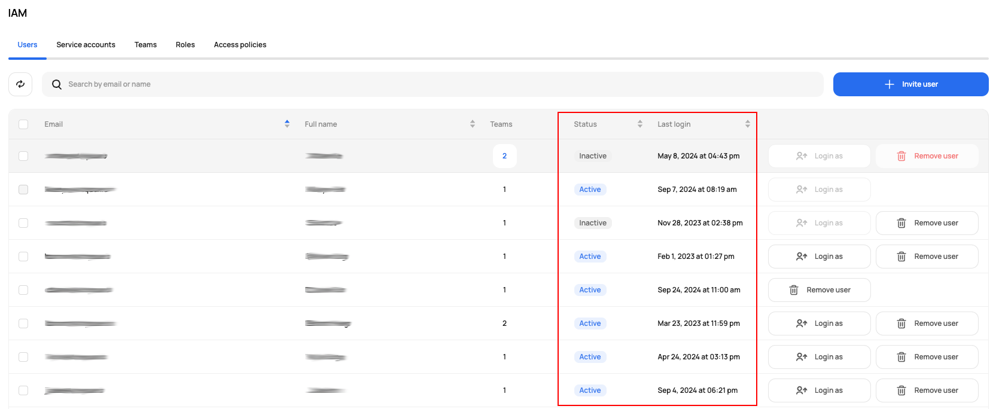
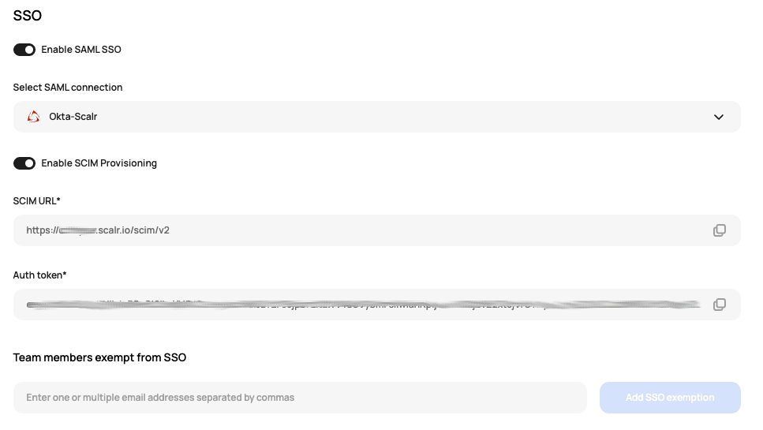

# [Scalr] 2. 입퇴사자에 대한 계정 관리 프로세스 검토

## Menu 
Administration > Security > IAM > Users

## 점검 방법 
**Status**를 기반으로 입퇴사자에 대한 계정 관리 프로세스가 적절히 이행되고 있는지 검토합니다. 

- `Active` : 퇴사자 중 아직 계정이 활성화되어 있는 사용자 존재 여부를 관리자는 주기적으로 검토하여 제거해야 합니다. IdP SCIM 연동을 통해 퇴사자 계정의 비활성화를 이행하고 있는지 확인합니다. 
- `Inactive` : 해당 퇴사자, 미사용자 계정을 별도 유지 보관하는 사유를 검토하고 없다면 제거합니다.  
- `Invited` : 장기간 활성화 이력이 없는 사용자를 주기적으로 체크하여 제거합니다. 

Administration > Security > `SSO`에서 **Enable SAML SSO**, **Enable SCIM Provisioning**이 활성화되어 라이프사이클이 관리되고 있다면 IdP측에서 관리 설정을 확인합니다. 

## 관련 통제 항목 (ISMS-P)
- 2.5.1 사용자 계정 관리
- 2.5.3 사용자 인증
- 2.5.6 접근권한 검토
- 2.10.1 보안시스템 운영
- 2.10.2 클라우드 보안