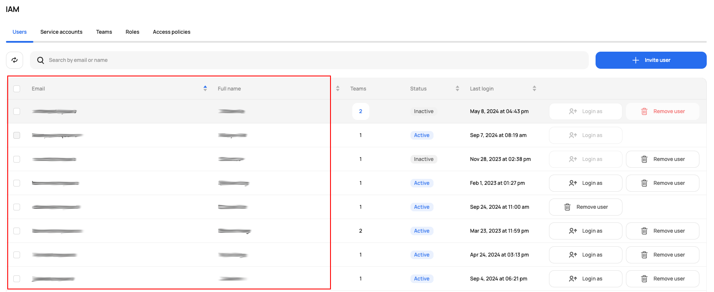

# [Scalr] 3. 사용자 계정 식별자 할당 여부

## Menu 
Administration > Security > IAM > Users

## 점검 방법 
각 사용자 별 식별 가능한 이메일 계정 및 성명으로 계정이 생성되고 관리되고 있는지 검토합니다.  
시스템 계정은 별도 Service accounts 탭에서 관리되므로, Users 탭 목록에서는 실제 사용자 계정 목록이 조회되어야 합니다. 

## 관련 통제 항목 (ISMS-P)
- 2.5.1 사용자 계정 관리
- 2.5.2 사용자 식별