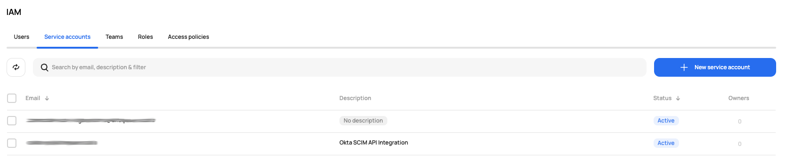
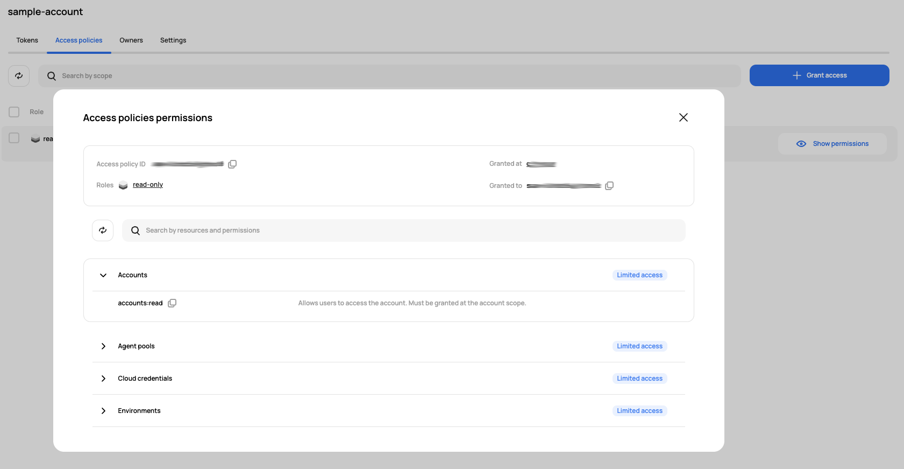

# [Scalr] 4. 시스템 계정 운영 현황 검토

## Menu 
Administration > Security > IAM > Service accounts

## 점검 방법 
시스템 계정 유무를 확인합니다. 

각 서비스 계정을 클릭하여 상세페이지로 이동한 뒤, **Access policies** 탭 내 조회되는 각 **Role** 우측 `Show Permissions`를 클릭하여 최소한의 권한으로 부여되어 있는지 검토합니다.  

시스템 계정의 경우, 해당 목적과 지속 사용 여부를 검토하고 불필요한 계정은 제거합니다. 

## 관련 통제 항목 (ISMS-P)
- 2.5.1 사용자 계정 관리
- 2.5.5 특수 계정 및 권한 관리
- 2.5.6 접근권한 검토
- 2.6.3 응용프로그램 접근
- 2.10.2 클라우드 보안