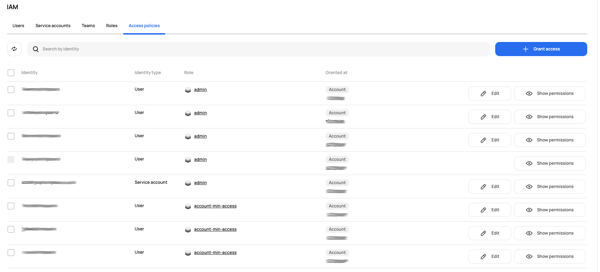

# [Scalr] 5. 사용자-그룹 권한 부여 현황 검토

## Menu 
Administration > Security > IAM > Access policies

## 점검 방법 
각 Identity (사용자/팀) 별 역할에 맞는 최소한의 권한(Role)이 부여되어 있는지 검토합니다. 

- 서비스 오너를 제외한 사용자에게 _**admin** role_ 부여된 계정이 있다면 권한 변경이 필요합니다. 

## 관련 통제 항목 (ISMS-P)
- 2.5.1 사용자 계정 관리
- 2.5.6 접근권한 검토
- 2.6.3 응용프로그램 접근
- 2.9.1 변경관리
- 2.10.2 클라우드 보안