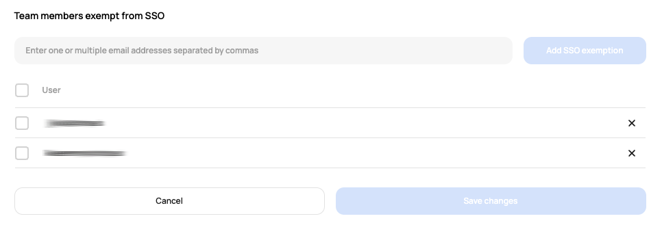

# [Scalr] 6. 특수 권한이 부여된 사용자에 대한 검토

## Menu 
Administration > Security > SSO

## 점검 방법 
SSO 활성화 환경에서 **Team members exempt from SSO**에 예외처리로 존재하는 사용자가 있는지 확인합니다. 
존재 시, 해당 사용자의 예외처리 사유 및 유효기간 등의 관리 프로세스가 제대로 이행되고 있는지 검토합니다.

## 관련 통제 항목 (ISMS-P)
- 2.5.5 특수 계정 및 권한 관리
- 2.5.6 접근권한 검토
- 2.6.3 응용프로그램 접근
- 2.10.2 클라우드 보안