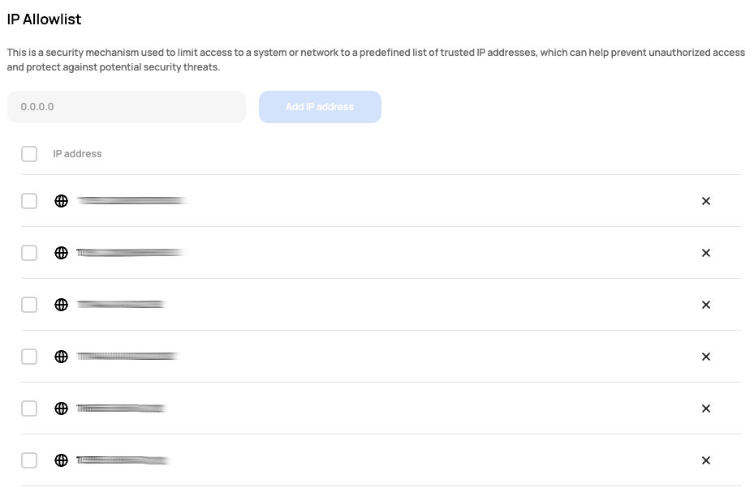

# [Scalr] 7. IP ACL을 통한 네트워크 접근 통제 여부

## Menu 
Administration > Security > IP Allowlist

## 점검 방법 
IP Allowlist에 신뢰할 수 있는 네트워크 IP대역 적용 여부를 확인합니다. 
최소한의 범위의 대역이 허용되어 있는지 여부 및 주기적으로 관리하고 있는지 검토합니다.

## 관련 통제 항목 (ISMS-P)
- 2.5.3 사용자 인증
- 2.5.6 접근권한 검토
- 2.6.3 응용프로그램 접근
- 2.10.1 보안시스템 운영
- 2.10.2 클라우드 보안