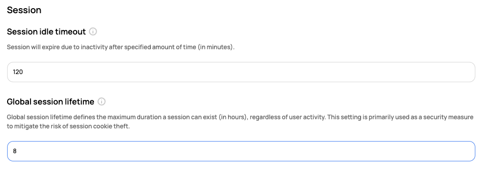

# [Scalr] 8. 사용자 세션 타임아웃 통제 설정 여부

## Menu 
Administration > Security > Session

## 점검 방법 
내부 관리지침에 따른 적정 수준의 세션 타임아웃 설정 여부를 확인합니다. 

- **Session idle timeout** : 세션 유휴 시간 설정 (분 단위)
- **Global session lifetime** : 세션 유효시간 설정 (시간 단위) 

## 관련 통제 항목 (ISMS-P)
- 2.5.3 사용자 인증
- 2.5.5 특수 계정 및 권한 관리
- 2.6.3 응용프로그램 접근
- 2.10.1 보안시스템 운영
- 2.10.2 클라우드 보안