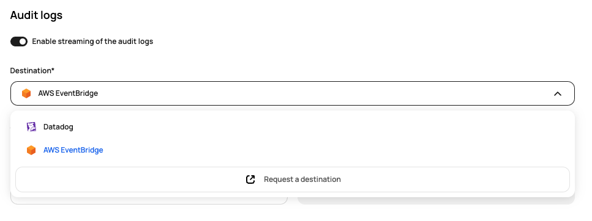

# [Scalr] 9. 로그 별도 보관 및 관리 여부

## Menu 
Administration > Security > Audit Logs

## 점검 방법 
**Enable streaming of the audit logs**설정 활성화 여부 혹은 별도 API연동을 통해 주기적으로 수집하고 관리하는 별도 모니터링 체계가 있는지 점검합니다. 

## 관련 통제 항목 (ISMS-P)
- 2.9.4 로그 및 접속기록 관리
- 2.9.5 로그 및 접속기록 점검