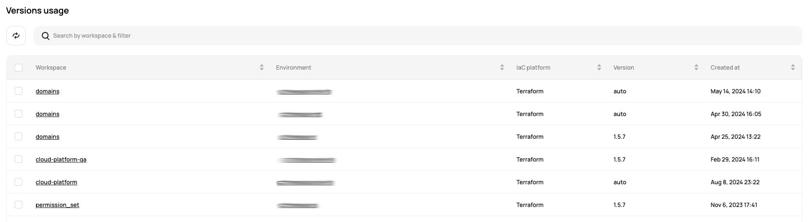
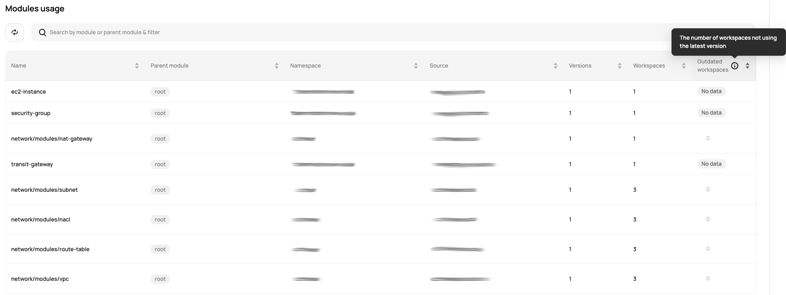

# [Scalr] 10. 각 어카운트 별 Terraform/OpenTofu 현황 검토

## Menu 
Administration > Reports  

## 점검 방법 

**Versions usage** 내 `Version`을 통해 Terraform/OpenTofu 버전을 주기적으로 관리하고 업데이트하는 프로세스를 이행하고 있는지 검토합니다.

**Modules usage** 내 `Outdated workspaces`를 통한 각 어카운트 별 최신 버전 미사용 워크스페이스가 있는지 식별합니다. 

## 관련 통제 항목 (ISMS-P)
- 2.10.1 보안시스템 운영
- 2.10.2 클라우드 보안
- 2.10.8 패치관리