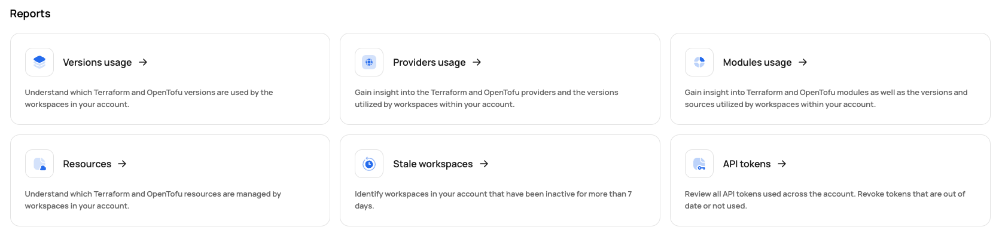
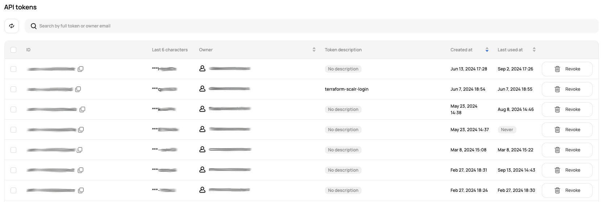

# [Scalr] 11. API 토큰 사용 현황 검토

## Menu 
Administration > Reports 

## 점검 방법 

**API tokens** 내 `Last used at`을 통한 API 호출이력을 통해 장기간 미사용 토큰 식별합니다. 

- 마지막 사용 일시가 `Never`로 표기되어 있거나, 내부 관리지침에 의한 기준 일정(예. 30일)을 초과한 미사용 토큰은 주기적으로 검토하여 제거합니다. 

## 관련 통제 항목 (ISMS-P)
- 2.5.5 특수 계정 및 권한 관리
- 2.9.4 로그 및 접속기록 관리
- 2.9.5 로그 및 접속기록 점검
- 2.10.2 클라우드 보안