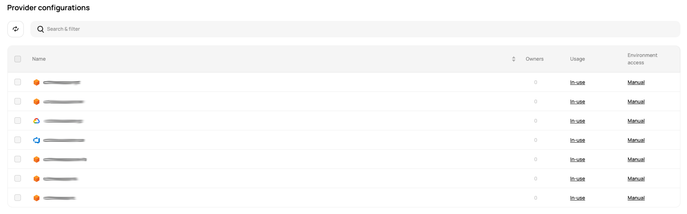
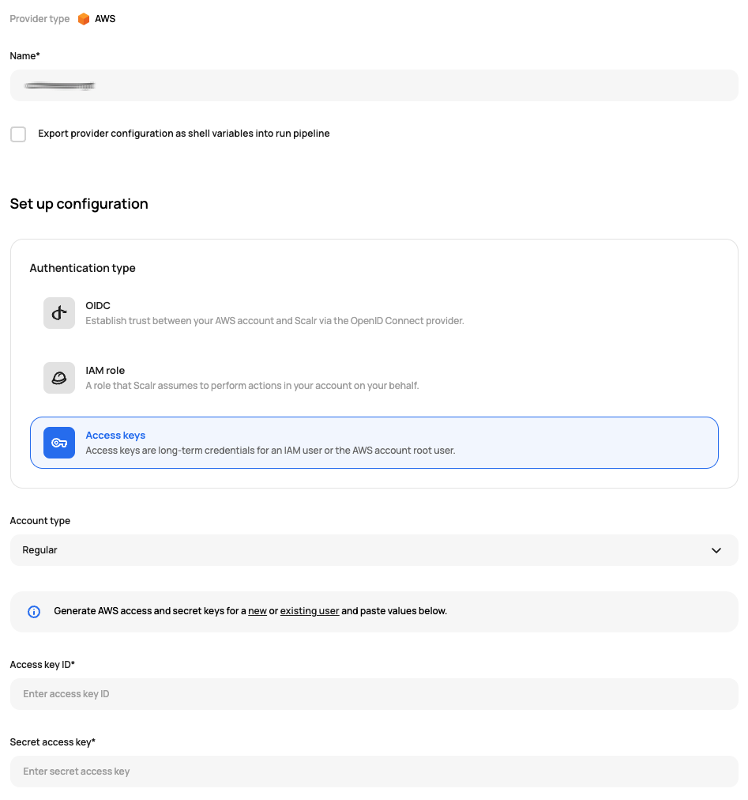
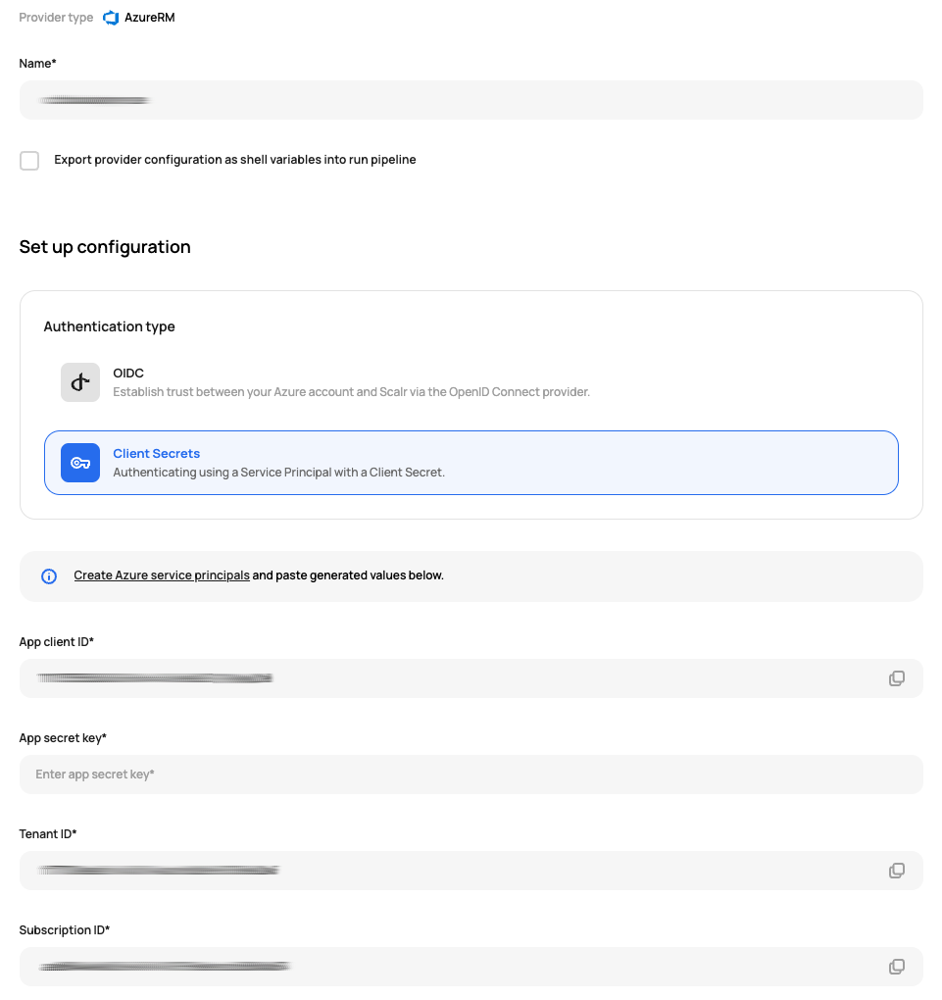
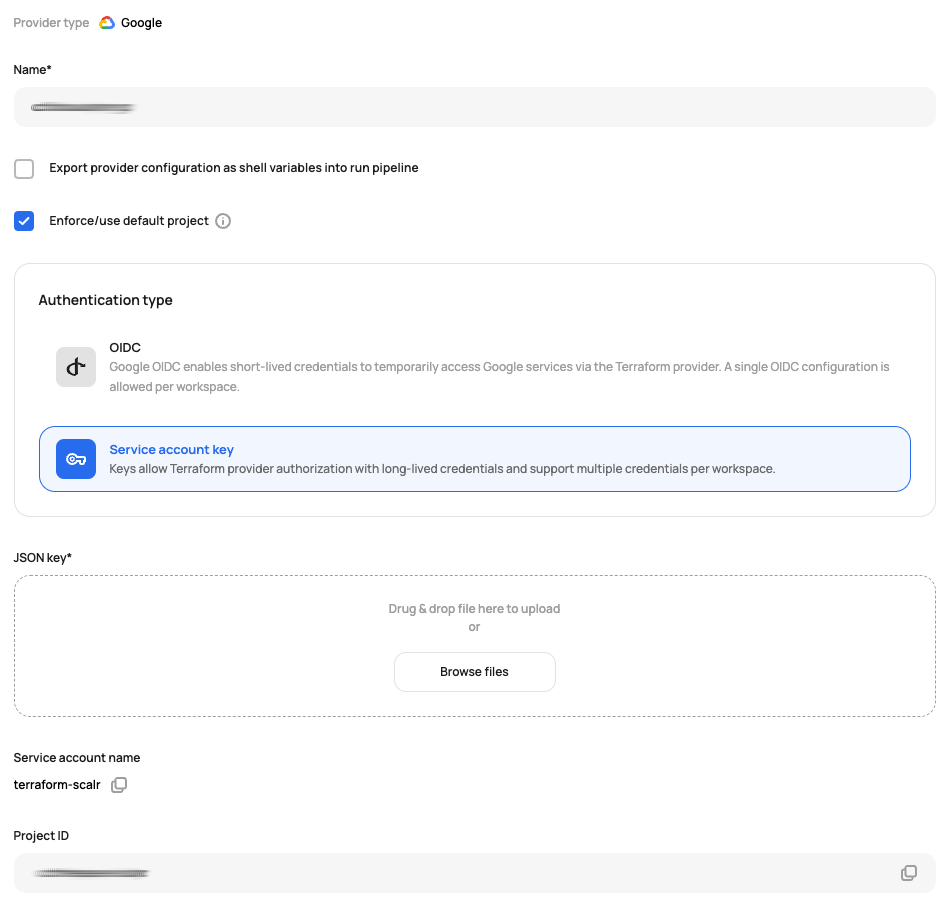

# [Scalr] 12. 클라우드 연동 계정에 대한 키 관리 여부

## Menu 
Administration > Inventory > Provider configurations

## 점검 방법 
플랫폼 별 연결 시 사용한 역할/키가 공용이 아닌 해당 서비스의 External ID가 명시되어 사용 주체가 명확하게 구분된 전용 credential인지 확인합니다. 플랫폼에서는 유형을 식별하고, 실제 credential의 검토는 해당하는 클라우드 플랫폼에서 검토가 되어야 합니다. 

각 프로바이더를 클릭하여 상세 설정 페이지로 이동하면, `Settings > General`탭에서 구성 현황을 식별할 수 있습니다. 

- AWS

    - AWS의 경우, Role ARN 또는 액세스 키 ID/Secret 검토 

- AzureRM

    - AzureRM의 경우, App client ID, Tenant ID, App Secret Key 등 credential 검토

- GCP

    - GCP의 경우, JSON Key 검토 

## 관련 통제 항목 (ISMS-P)
- 2.5.5 특수 계정 및 권한 관리
- 2.10.2 클라우드 보안