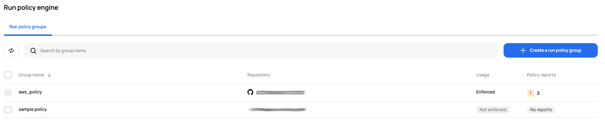

# [Scalr] 13. IaC 스캐닝 정책 적용 검토

## Menu 
Administration > Inventory > Run policy engine

## 점검 방법 
클라우드 네이티브 환경에서 정책을 관리하고 실행하는 오픈 소스 정책 엔진인 OPA(Open Policy Agent) 정책을 적용할 수 있는 페이지입니다. OPA는 IaC 입력 데이터를 관리자가 정의한 규칙과 비교 평가하는 정책 코드로, 다양한 시스템에서 일관된 정책 결정을 내릴 수 있도록 지원하며 보안, 네트워크, 데이터 접근 제어 등의 여러 분야에서 사용됩니다. 

**Run policy engine** 내 구성된 OPA 정책 그룹이 있는지 검토합니다. 

- **Usage** 항목 내 `Enforced` 여부를 통해 실제 Policy가 적용되어 있는지 확인합니다. 

## 관련 통제 항목 (ISMS-P)
- 2.9.1 변경관리
- 2.10.1 보안시스템 운영
- 2.10.2 클라우드 보안