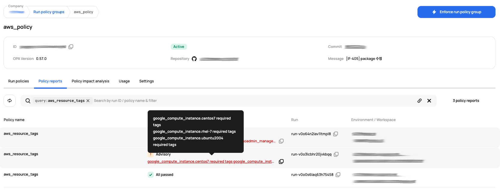

# [Scalr] 14. 운영중인 OPA 현황 검토

## Menu 
Administration > Inventory > Run policy engine

## 점검 방법 
Terraform 및 OpenTofu 배포를 관리하기 위해 운영 중인 정책이 있는지 확인합니다.

각 정책 별 **Policy reports** 및 **Policy impact analysis**에 대한 내역을 주기적으로 별도 검토하고 정책 위반사항에 대하여 개선하는 프로세스가 이행되고 있는지 검토합니다.  

## 관련 통제 항목 (ISMS-P)
- 2.9.1 변경관리
- 2.9.5 로그 및 접속기록 점검
- 2.10.1 보안시스템 운영
- 2.10.2 클라우드 보안